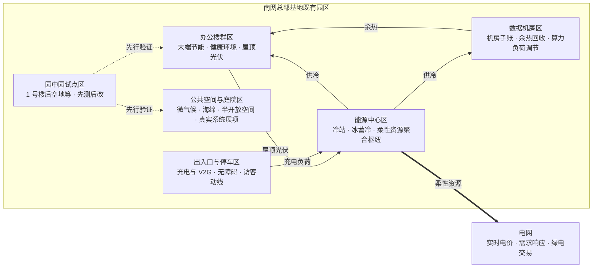
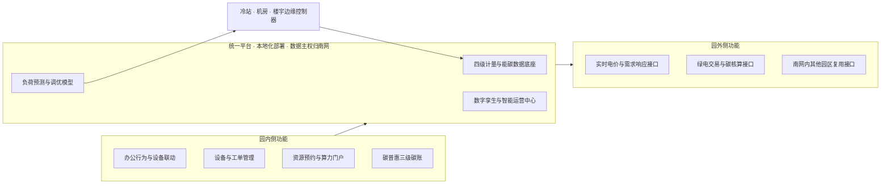
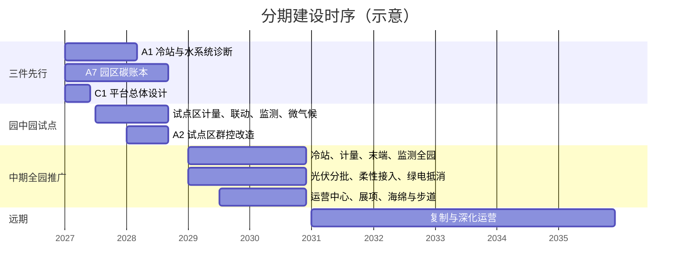

# 南网总部基地绿色智慧近零碳园区规划方案

**（规划方案 · 工作稿）**

编制单位：南网能源公司（主笔）

规划对象：南网总部基地既有园区

编制日期：2026 年 9 月 2 日

稿件性质：园区规划方案，用于确定总部基地既有园的规划目标、指标体系、总体布局、专项规划、重点项目库与分期建设计划，作为后续预可行性方案、专项设计与年度建设计划的上位依据。本稿不是调研报告、方向论证材料或请示件。稿中缺失或未经核证的数据以【待核】标注，核证后按程序更新指标值，不改变规划结构。

---

## 第一章 规划范围、期限与依据

### 一、规划范围

规划范围为南网总部基地既有园区全部用地、建筑及其配套系统，包括：办公楼群及其围护结构、室内环境与照明末端；园区冷站、冰蓄冷系统、输配水系统与空调末端；数据机房及其供配电、制冷系统；园区供配电系统、既有光伏、充电设施；园区道路、庭院、绿地、水体与公共空间；园区信息化与自动化系统。

碳核算与用能核算边界按全园确定，同时分设“办公区”与“数据机房”两个子账。全园总账用于近零碳目标考核，两个子账用于分析各自的降碳路径与责任划分。数据机房是否在认证申报时单列，随认证口径确定后另行处理，不影响本规划的边界设定。

### 二、规划期限

规划基期为 2027 年，以 2027 年一个完整供冷季的实测数据作为基期基线。规划期为 2027—2035 年，分三期：

| 分期 | 年限 | 阶段任务 | 目标年 |
| --- | --- | --- | --- |
| 近期 | 2027—2028 年 | 建立基线与碳账，完成平台总体设计，园中园试点建成并取得一个供冷季数据，达到低碳档 | 2028 年 |
| 中期 | 2029—2030 年 | 全园推广，建成绿色、智慧、近零碳园区，达到近零碳档 | 2030 年 |
| 远期 | 2031—2035 年 | 深化运营，向南网内其他园区复制；结合绿电与抵消机制条件研究碳中和路径 | 2035 年 |

### 三、规划依据

**（一）国家政策与规划。** 中共中央办公厅、国务院办公厅关于做好节能降碳工作的意见；国务院节能降碳行动方案；国家发展改革委、国家能源局、国家数据局加快构建新型电力系统行动方案；国家发展改革委、国家能源局关于推进“人工智能+”能源高质量发展的实施意见；国管局等部门公共机构绿色低碳引领行动实施方案（作大型总部办公园区的方向参照）；住房和城乡建设部建筑节能与绿色建筑发展规划及城乡建设领域碳达峰实施方案。

**（二）标准规范。** 《建筑节能与可再生能源利用通用规范》GB 55015；《建筑与市政工程无障碍通用规范》GB 55019；《公共建筑节能设计标准》GB 50189；《民用建筑能耗标准》GB/T 51161；《绿色建筑评价标准》GB/T 50378；《既有建筑绿色改造评价标准》GB/T 51141；《近零能耗建筑技术标准》GB/T 51350；《零碳建筑技术标准》（稿件状态与实施时间【待核】，其园区层级台阶作目标档位参照，正式文本发布后校核）；室内空气质量、照明、声环境等相关国家标准；健康建筑相关标准（团体标准，作引导性指标参照）。

**（三）公司层面依据。** 南网以新型电网为枢纽推进协同发展的战略部署（表述以正式文件为准）；2026 年 8 月 26 日总部基地节能改造规划方案研讨会已定事项；2026 年 8 月 27 日关于推进总部基地框架方案编制有关工作的安排；南网总部基地北京调研报告（2026 年 8 月）；《南网总部基地建设框架方案》修订稿（2026 年 8 月 30 日）。总部基地建设方案 V3 仅作园区家底、现状与卡点的资料来源，不作为本规划的立意与编制依据。

### 四、规划定位与原则

总部基地是南网整体的名片和战略资产价值体系的验证场，走“内部验证—行业复制”路径；基地本身不是第二增长曲线，能源公司承担主笔与实施牵头，战略主体是南网。本规划以绿色、智慧、近零碳为三条主线，相互支撑：绿色管能与碳、水与生态；智慧管数字底座与运营；近零碳是园区的目标属性，由绿色提供减碳与抵消路径、由智慧提供可核验的数据。已锁定的六要素——绿色、高效、智慧、普惠、健康、人文——落到专项规划与指标体系中，不再单独成篇。

规划遵循四条原则：

1. **不停机、分区实施。** 约 5000 人持续办公【待核】，一切改造以园中园、分区试点方式推进，不做成片停机的整体改造。
2. **先测后改、以数定标。** 实测基线先于指标值，指标值先于设备选型；口述与资料宣称的数据只作量级参照。
3. **一次规划、分期建设。** 平台、计量、碳账等底座性内容一次规划到位，工程分期实施，避免二次集成。
4. **成果可复制。** 每个项目的产出除工程实体外，须包含可带走的方法、数据或规则，供南网内其他园区复用。

---

## 第二章 现状与约束

### 一、园区家底

| 项目 | 现状 | 资料来源与口径 |
| --- | --- | --- |
| 区位与性质 | 广州科学城，南网总部既有办公园区，多栋办公楼群与配套设施 | 建设方案 V3、交流纪要 |
| 人员规模 | 约 5000 人持续办公 | 交流纪要【待核】 |
| 建筑与风貌 | 既有建筑具有历史风貌价值，外立面不可大改；屋顶光伏空间有限，立面尚未布置光伏 | 交流纪要【待核】 |
| 主要机电设备 | 2016 年投运，运行已满十年、未到报废年限；采购约在 2014—2015 年 | 交流纪要【待核】 |
| 供冷系统 | 集中冷站，配冰蓄冷系统；蓄冷主机在零度以下运行，经济性建立在固定低谷电价之上 | 交流纪要【待核】 |
| 数据机房 | 园区内设数据机房，能耗量级大；是否计入园区用电口径存在两种说法 | 交流纪要【待核】 |
| 年用电量 | 约 7000 万度，存在“含/不含数据机房”两种并存口径；其中空调与办公建筑约 3500 万度 | 会中口述【待核】 |
| 既有光伏 | 现状装机约 2 点几兆瓦，不足 3 兆瓦；并网点、发电量与消纳方式待查 | 会中口述【待核】 |
| 可用场地 | 1 号楼后空地可作试点场地；庭院、架空层、连廊、车棚等半开放空间待普查 | 交流纪要【待核】 |
| 信息化系统 | 楼宇自控、能耗监测、安防、办公等系统分头建设，分项计量覆盖程度与数据接口待踏勘 | 【待核】 |

### 二、能耗与碳排放现状

园区用能以电力为主，供冷负荷是用能重心。按会中口述口径，空调与办公建筑用电约占园区用电的一半【待核】；数据机房用电量级尚无数据【待核】。园区尚未建立碳账本，无经复核的碳排放基线。本规划以 2027 年供冷季实测数据作为基期基线，基线形成前，本规划的降碳率指标只给台阶，不给绝对值。

### 三、机电系统与冷站

冷站是园区用能的第一大系统，也是近期改造的主战场。现状特征与判断如下：

- 主机、水泵、冷却塔与输配管网运行满十年，具备诊断与调优条件，尚不具备整体更换理由；不换主机条件下的节能潜力，会中估算与产品资料两方独立给出的区间均为 10%—20%【待核】。
- 冰蓄冷控制策略以固定低谷电价为前提；国家已取消固定低谷时段，广东实施细则预计转向约 15 分钟级实时电价【待核】，现有策略在细则落地后将失去经济性基础。
- 空调末端、照明与办公行为尚未联动，会议室、公共区存在非使用时段用能。
- 数据机房制冷与办公区供冷系统的关系、机房余热的可回收量级均待摸底【待核】。

### 四、空间与风貌

园区建筑风貌具有延续价值，外立面不作大改，围护结构改造与立面光伏受到限制。可利用的空间资源集中在屋顶、露台、车棚、庭院、架空层、连廊与 1 号楼后空地等处，这些空间是光伏加装、微气候改善、半开放公共空间与试点建设的主要载体。园区无障碍现状、步行系统连续性与休憩节点分布待专项排查【待核】。

### 五、主要约束与规划应对

| 约束 | 对规划的影响 | 规划应对 |
| --- | --- | --- |
| 连续办公，不能成片停机 | 排除整体停机改造与大规模管线更换 | 园中园、分区试点；改造以控制回路、末端与增量设施为主，施工安排在非办公时段与低负荷季 |
| 风貌与外立面不可大改 | 围护结构与立面光伏不可作主路径 | 针灸式局部更新；光伏布置于屋顶、露台、车棚；微气候改善以庭院与植被承担 |
| 设备满十年未到报废 | 缺乏整体换新理由 | 先诊断分档、后定改造深度；不换主机的群控与调优优先 |
| 屋顶光伏空间有限 | 本地可再生能源贡献比例有限 | 光伏应装尽装但不作达标主路径；降碳主力为需求侧节能与绿电交易 |
| 电价机制转向实时电价 | 现有蓄冷经济性失效 | 蓄冷策略与交易、需求响应接口列为近期必做项目 |
| 数据机房核算口径未定 | 影响目标基数、余热利用与算力普惠安排 | 全园总账加两个子账，先立账再定档 |

### 六、基础资料缺口

以下基础资料在本规划中以【待核】处理，规划结构不因其缺失而改变；资料到位后更新对应指标值与项目规模。

| 资料 | 用途 | 获取方式 | 时限 |
| --- | --- | --- | --- |
| 园区年用电量与分项结构（含机房口径） | 基期基线、降碳率分母 | 园区平台数据核验 | 预可研启动前 |
| 既有光伏装机、并网与发电量 | 可再生能源指标 | 并网资料核验 | 预可研启动前 |
| 冷站分项能耗与运行参数 | 冷站能效基线 | 实测诊断（项目 A1） | 一个完整供冷季 |
| 机房余热可回收量与园区热需求 | 余热利用项目规模 | 园区踏勘摸底 | 近期 |
| 屋顶、露台、车棚可装光伏面积 | 光伏项目规模 | 卫星影像评估与现场普查 | 近期 |
| 分项计量覆盖、设备接口与网络安全边界 | 平台设计输入 | 园区踏勘与运维资料 | 平台总体设计前 |
| 《零碳建筑技术标准》稿件状态与台阶值 | 目标档位校核 | 向主编单位书面确认 | 预可研启动前 |

---

## 第三章 规划目标与指标体系

### 一、总体目标

到 2030 年，把南网总部基地既有园区建成绿色、智慧、近零碳园区：园区碳排放达到近零碳档位；能源系统以冷站为核心完成高效化改造并接入实时电价与需求响应；建成“一个平台、两类功能”的数字底座，园区运行数据可计量、可核验、可交易；园区环境健康可检、场所风貌延续、全员参与减碳并共享园区资源与算力；形成一套可向南网内其他园区复制的碳账口径、调控模型、数据资产与改造运营方法。

### 二、分项目标

**（一）近零碳目标。** 以住建部体系园区层级台阶为目标档位参照：近期（2028 年）达到低碳档，中期（2030 年）达到近零碳档；碳抵消量占比不超过标准规定上限。台阶值以正式发布的《零碳建筑技术标准》为准【待核】。降碳路径按“需求侧节能—本地可再生能源—绿电交易—合规抵消”的次序安排，绿电交易是达到近零碳档的主要抵消手段，本地光伏应装尽装但不作达标主路径。

**（二）绿色目标。** 冷站与机电系统在不换主机前提下取得实测节能；蓄冷等柔性资源接入实时电价并保持经济性；园区水循环、海绵化与植被系统改善微气候；室内环境参数按国家标准连续达标，节能改造不以空气品质为代价。

**（三）智慧目标。** 一个平台承接园内运营与园外互动两类功能；四级用能计量全覆盖，计量数据同时满足碳核算与电力交易结算；负荷预测与调优模型在线运行；平台与模型本地化部署，数据主权归南网。

**（四）六要素分解。** 绿色与高效落在近零碳与能源专项及绿色生态专项；智慧落在智慧运营专项；普惠落在“人人参与、人人受益”三项内容（碳普惠、算力普惠、园区资源普惠），无障碍为标配；健康落在可检可验的室内环境与健康服务；人文落在风貌保护下的场所品质与真实系统展示。

### 三、指标体系

指标分控制性与引导性两类。控制性指标为规划期内必须达到的指标，纳入项目验收与年度运营评估；引导性指标为努力方向，随基期基线与专项设计校定。基期值均以 2027 年供冷季实测结果为准，本表基期列一律为“待实测”。

| 序号 | 指标 | 要素归属 | 属性 | 2028 年 | 2030 年 | 说明 |
| --- | --- | --- | --- | --- | --- | --- |
| 1 | 园区碳排放降碳率（较基期基准） | 近零碳·绿色 | 控制性 | 达低碳档 | 达近零碳档 | 台阶值按国家标准正式文本【待核】 |
| 2 | 碳抵消量占基准排放比例 | 近零碳·绿色 | 控制性 | 不超标准上限 | 不超标准上限 | 上限值【待核】 |
| 3 | 园区碳账本覆盖率（纳入核算的用能单元占比） | 近零碳·智慧 | 控制性 | 100% | 100% | 全园总账加两个子账 |
| 4 | 绿电（本地光伏加绿电交易）占园区用电比例 | 近零碳·绿色 | 引导性 | 随抵消结构方案确定 | 满足近零碳档所需 | 绿电交易口径以正式规则为准 |
| 5 | 光伏装机容量 | 绿色 | 引导性 | 完成普查并实施首批加装 | 普查可装容量应装尽装 | 现状约 2 点几兆瓦【待核】 |
| 6 | 冷站综合能效（较基期） | 高效 | 控制性 | 提升不低于 10% | 提升不低于 15% | 估算区间 10%—20%【待核】，基线后校定 |
| 7 | 单位建筑面积综合能耗 | 高效 | 控制性 | 不高于《民用建筑能耗标准》约束值 | 不高于引导值 | 标准值按建筑类型与气候区取用 |
| 8 | 蓄冷策略与实时电价、需求响应接口 | 高效·智慧 | 控制性 | 过渡期策略上线 | 稳态策略在线运行 | 随广东细则进度调整【待核】 |
| 9 | 可调节柔性负荷容量占园区最大负荷比例 | 绿色·高效 | 引导性 | 形成资源清单 | 随试点结果确定 | 蓄冷、光伏、储能、充电、算力负荷 |
| 10 | 会议室与公共区末端预约联动覆盖率 | 高效·智慧 | 控制性 | 试点区 100% | 全园 100% | 参照信息港预约联动手法 |
| 11 | 四级用能分项计量覆盖率 | 智慧 | 控制性 | 100% | 100% | 地块—楼宇—区域—楼层 |
| 12 | 主要机电设备接入统一平台比例 | 智慧 | 控制性 | 试点区 100% | 全园不低于 90% | 以设备清单为分母 |
| 13 | 平台与模型本地化部署、数据主权条款 | 智慧 | 控制性 | 落实 | 落实 | 选型前置条件 |
| 14 | 冷站与末端负荷预测精度 | 智慧 | 引导性 | 形成基线 | 较基线持续提升 | 精度口径随模型设计确定 |
| 15 | 非传统水源利用率 | 绿色 | 引导性 | 试点区形成指标 | 全园按专项设计值 | 中水、雨水回用 |
| 16 | 透水铺装比例、绿量与通风廊道 | 绿色·人文 | 引导性 | 试点场地完成 | 全园按专项设计值 | 与风貌保护协调 |
| 17 | 碳普惠注册参与率（员工与常驻外包） | 普惠 | 引导性 | 不低于一半 | 覆盖绝大多数 | 三级碳账上线为前提 |
| 18 | 全员算力与 AI 工具开通率 | 普惠 | 控制性 | 全员开通 | 全员开通 | 用量透明、门槛低 |
| 19 | 统一预约平台覆盖资源类别 | 普惠·智慧 | 引导性 | 会议、充电、文体 | 全部可预约资源 | 员工、外包、访客公平可及 |
| 20 | 无障碍设施达标率 | 普惠 | 控制性 | 排查整改完成 | 100% | 按国家强制性规范 |
| 21 | 室内 CO₂、PM2.5、温湿度达标时长占比 | 健康 | 控制性 | 试点区连续监测达标 | 全园连续监测达标 | 阈值按国家标准 |
| 22 | 环境监测点位覆盖率（楼层级） | 健康·智慧 | 控制性 | 试点区 100% | 全园 100% | 数据接入平台并公示 |
| 23 | 办公区照度与眩光达标率 | 健康 | 引导性 | 试点区达标 | 全园达标 | 结合照明更新实施 |
| 24 | 外立面大改工程数量 | 人文 | 控制性 | 0 | 0 | 风貌保护约束 |
| 25 | 半开放公共空间面积增量与使用率 | 人文·健康 | 引导性 | 试点场地建成 | 按专项设计值 | 岭南微气候适应 |
| 26 | 真实系统展项参观动线 | 人文 | 控制性 | 动线设计完成 | 建成运行 | 不建独立展馆 |
| 27 | 员工环境与服务满意度 | 健康·人文 | 引导性 | 形成基线 | 较基线提升 | 调查口径随运营方案确定 |

### 四、指标管控

控制性指标写入各项目的建设任务书与验收条件，年度运营评估逐项核对；引导性指标在基期基线形成后、专项设计阶段校定目标值并转为设计输入。任何节能措施须同时满足指标 6 与指标 21，一项不达标即不通过验收。指标值调整须经规划修编程序，不得在项目实施中自行下调。

---

## 第四章 总体布局

### 一、空间结构

园区空间结构以“既有格局不变、系统重组、节点更新”为总则，按功能形成五类分区和一个试点区。空间结构示意如下（拓扑关系示意，不代表实际方位与尺度）。

文字示意：能源中心区（冷站、冰蓄冷）向办公楼群区与数据机房区供冷，是园区能量流的枢纽；数据机房区余热经热泵回供办公区热需求；办公楼群区屋顶、车棚光伏与停车区充电负荷一并纳入能源中心区聚合的柔性资源池，对外接入实时电价、需求响应与绿电交易；公共空间与庭院区承担微气候、海绵与展示功能；园中园试点区先行验证办公区与公共空间两类措施。

### 二、功能分区与规划指引

| 分区 | 范围 | 主要功能 | 绿色·近零碳指引 | 智慧指引 | 健康·人文·普惠指引 |
| --- | --- | --- | --- | --- | --- |
| 办公楼群区 | 各办公楼及其屋顶、露台 | 日常办公 | 末端与照明节能；新风净化；屋顶与露台光伏 | 会议预约联动末端；楼层级计量与环境监测 | 节律照明与工位微环境；无障碍动线；碳普惠记账入口 |
| 数据机房区 | 数据机房及其配电、制冷 | 数据与算力 | 机房子账；PUE 管控；余热回收；机房制冷与园区冷站协调 | 算力负荷可观测、可调节；算力普惠门户 | 参观动线经运营数据展示，不进机房核心区 |
| 能源中心区 | 冷站、蓄冷、配电、光伏并网点 | 园区能源枢纽 | 冷站群控与调优；蓄冷策略接实时电价；柔性资源聚合 | 边缘控制器与园外接口；调控与交易模型运行 | 真实系统展项第一站 |
| 公共空间与庭院区 | 庭院、架空层、连廊、绿地、水体 | 休憩、交流、展示 | 海绵化与雨水回用；乔木与垂直绿化；通风廊道 | 室外环境监测；预约与活动信息 | 半开放空间；步道与休憩节点；双碳科普 |
| 出入口与停车区 | 门区、停车场、车棚 | 出入、停车、接待 | 车棚光伏；充电桩与 V2G 试点 | 访客预约与无感通行；充电资源分时共享 | 无障碍入口；访客接待与动线起点 |
| 园中园试点区 | 1 号楼后空地及邻近楼宇【待核】 | 先行验证 | 冷站末端调优、微气候试点 | 平台首批功能上线 | 环境监测与公示、碳普惠首批用户 |

### 三、能源系统布局

园区能源系统按“源—网—荷—储—市场”五层布置：

- **源。** 本地光伏布置于屋顶、露台、车棚，立面不布置；绿电交易作为外部绿色电源，接入园区碳账。
- **网。** 维持现有园区配电格局，在充电与光伏集中的停车区研究直流配电试点，不作全园改造。
- **荷。** 冷站、数据机房、办公楼群三类主要负荷分别计量、分别建模；办公末端负荷通过预约联动实现“该用才用”。
- **储。** 以既有冰蓄冷为主，电化学储能与 V2G 作为可选项随实时电价细则落地后比选。
- **市场。** 柔性资源池统一经能源中心区接口接入实时电价、需求响应与绿电交易，形成园区级调控与交易模型。

设施落位原则：不新增独立能源建筑；新增设备优先利用既有机房、屋顶与车棚；与风貌保护冲突的布置一律不采用。

### 四、碳管理布局

碳管理按“一本总账、两个子账、三级普惠账”布置。总账覆盖全园，以 GB 55015 为基准核算；办公区与数据机房两个子账分别归集用能与减碳量；个人—团队—园区三级碳普惠账把员工低碳行为聚合进园区总账。碳账数据的采集点与四级计量点同址布置，计量口径同时满足碳核算与电力交易结算。

### 五、智慧设施布局

智慧设施按“一个平台、两类功能、四级计量、一个运营中心”布置：

- **一个平台。** 园区统一平台，本地化部署，数据主权归南网；园内侧承接办公行为与设备联动、设备与工单、资源预约、碳普惠记账；园外侧承接电网互动、实时电价与交易接口、碳核算与绿电溯源。
- **四级计量。** 地块—楼宇—区域—楼层四级计量点全覆盖，补齐分项计量缺口。
- **边缘控制。** 冷站、机房、各楼宇设边缘控制器，承担本地闭环控制与数据预处理，保证网络异常时基本运行。
- **运营中心。** 利用既有房间设置智能运营中心，兼作真实系统展项的第一站，不新建展馆、不做大屏秀。
- **网络安全分区。** 办公网、设备控制网与园外接口分区隔离，安全边界在平台总体设计中确定【待核】。

系统架构示意如下。

### 六、绿色生态与公共空间布局

以庭院、架空层、连廊、绿地串联形成连续的半开放空间与步行系统；组织顺应主导风向的通风廊道，配合乔木与遮阳设施改善夏季体感；道路与广场按海绵化改造，雨水与中水回用于绿化与水景；公共空间同时承担休憩、健身、活动与双碳科普功能。所有改造在既有风貌框架内进行，不改变建筑外立面。

---

## 第五章 专项规划

### 一、近零碳与能源专项

本专项承接绿色与高效两个要素，是近零碳目标的主体路径。

**（一）碳账本与核算体系。** 建立园区碳账本，基准年与基准排放按 GB 55015 及《零碳建筑技术标准》口径确定【待核】；总账加两个子账的结构见第四章。核算边界规则、数据机房进出账规则、绿电与抵消计入规则书面化，形成《园区碳核算规则》并每年复核。碳账本由统一平台自动生成，人工复核后公示。

**（二）降碳路径与抵消结构。** 降碳按四步安排：第一步需求侧节能，以冷站与机电系统、末端联动为主；第二步本地可再生能源，屋顶、露台、车棚光伏应装尽装；第三步绿电交易，按近零碳档缺口采购，来源可溯源；第四步合规抵消，控制在标准上限之内。抵消结构方案在基线形成后编制，随年度碳账更新。

**（三）冷站与机电系统。** 以“诊断—分档—改造—调优”为序：

| 内容 | 规划要求 | 系统与位置 |
| --- | --- | --- |
| 深度诊断 | 对冷机、水泵、冷却塔、输配管网、末端实测诊断，形成分项能耗基线与设备健康度分档 | 能源中心区冷站；各楼宇末端抽样 |
| 群控与调优 | 多机组优化加载、变频、大温差、末端联动；负荷预测驱动的运行调优；不换主机 | 冷站群控系统；平台调优模型 |
| 水系统 | 水泵变频与水力平衡；冷却塔运行优化 | 冷站输配系统 |
| 末端与照明 | 会议室、公共区照明与空调末端接入预约系统，非预约时段自动关闭；人来灯亮人走灯灭；智能空开插座 | 各办公楼；试点区先行 |
| 楼宇分档 | 按诊断结果对楼宇分档排序，确定分期改造顺序；认证达标回国家标准口径核算 | 全园楼宇 |

**（四）冰蓄冷与实时电价。** 编制过渡期与稳态期两套控制策略：过渡期沿用峰谷价差逻辑并预留接口；稳态期以约 15 分钟级实时电价【待核】为输入，结合负荷预测优化蓄冷、放冷与主机直供比例。策略与电力交易、需求响应平台的接口在平台总体设计中一并确定。

**（五）光伏与柔性资源。** 先以卫星影像与现场普查确定屋顶、露台、车棚可装容量，再分批加装，自发自用、余电上网；立面不布置。蓄冷、光伏、充电桩、可选储能与可调节的算力负荷聚合为柔性资源池，形成可观测、可调节的容量清单，接入实时电价与需求响应。

**（六）数据机房。** 建立机房子账；机房制冷与园区冷站协调运行；余热经热泵用于生活热水、除湿再热等需求，需求侧量级先摸底【待核】；算力负荷的可调节能力纳入柔性资源池，与算力普惠共用底座。

### 二、绿色生态专项

本专项承接绿色要素的生态部分，并为健康、人文专项提供空间界面。

- **水循环与海绵化。** 道路、广场透水铺装改造；雨水收集回用于绿化与水景；研究中水回用范围；试点场地先行。
- **植被与微气候。** 增补乔木与垂直绿化，组织通风廊道与遮阳，改善庭院与步行空间的夏季体感；室外环境监测点接入平台，以实测数据验证改善效果。
- **半开放空间。** 利用架空层、连廊、庭院形成遮阳通风的半开放空间，兼作休憩、健身与活动场所；1 号楼后空地作为第一个试点场地【待核】。
- **风貌协调。** 生态与景观改造不改变建筑外立面，新增构筑物的体量、材质与色彩服从既有风貌。

### 三、智慧运营专项

本专项承接智慧要素，是近零碳目标的数据基础与运营手段。

**（一）平台架构。** 按“一个平台、两类功能”一次规划、分期建设。园内侧功能：办公行为与用能设备联动、设备全生命周期与工单管理、统一资源预约、算力门户、碳普惠记账。园外侧功能：实时电价与需求响应接口、绿电交易与碳核算接口、南网内其他园区复用接口。平台与模型本地化部署，数据归属、合规、外部模型重训责任写入选型前置条件。

**（二）计量与数据底座。** 四级用能计量全覆盖，环境、设备状态、人流与预约数据同平台汇聚，形成能碳数据底座；计量口径同时满足碳核算与电力交易结算。

**（三）数字孪生与运营中心。** 以园区模型实时联动入园人数、会议室使用率、设备状态、能耗与碳指标，叠加电网侧负荷、电价与绿电数据；异常识别与预警闭环；运营中心以真实运行数据为展项。

**（四）预测与调优模型。** 建立冷站与末端负荷预测模型，与实时电价、需求响应打通，驱动冷站群控与蓄冷策略；模型以本项目实测数据训练与持续校正。

**（五）手法参照。** 会议预约联动照明与空调末端、四级用能监测、园区运营平台按人员、服务、设备、能耗、安防、空间组织功能模块等做法，参照中国移动国际信息港的实践经验；本项目的落点差异在于叠加电网侧数据与交易接口、计量口径两用、数据主权自持。

### 四、普惠专项

普惠按“人人参与、人人受益”规划三项内容，无障碍为标配。普惠不涉及投资收益、服务定价与对外服务包。

- **碳普惠。** 建立个人—团队—园区三级碳账，通勤、用能、会议、无纸化等低碳行为自动记账，园区总账人人可见；对接广东、广州碳普惠机制方法学【待核】；以轻交互小程序承载，积分可兑换园区文体与服务资源。
- **算力普惠。** 园区算力与 AI 工具（办公助手、知识库、会议纪要等）向全员与业务部门开放，用量透明、申请门槛低；与算电协同验证共用算力底座。
- **园区资源普惠。** 充电、会议、文体、餐饮、共享空间对员工、外包、访客公平可及，预约与分配规则公开；部分公共空间在安保与保密评估后向公众开放做双碳科普【待核】。
- **无障碍与适老化。** 按国家强制性规范完成全域无障碍动线、信息无障碍与适老化设施排查整改。

### 五、健康专项

健康独立于人文，规划对象是可检测、可验收的员工健康环境。

- **环境监测与公示。** 楼层级连续监测 CO₂、PM2.5、TVOC、温湿度、噪声、照度并公示，数据接入平台；阈值按国家标准。
- **新风与净化。** 风系统诊断与冷站诊断同步；新风量校核、过滤净化升级；与节能措施互锁，CO₂ 达标时长不得因节能下降。
- **健康照明与工位微环境。** 色温可调节律照明、眩光治理、工位个性化调节，与末端联动改造同步实施。
- **健身、休憩与心理健康。** 利用边角空间与半开放空间布置健身空间、步道与休憩节点；配套员工心理健康服务。
- **数据治理。** 健康与环境数据仅用于环境改善与验收，不用于个人考核，权限与用途规则书面化。

### 六、人文专项

人文规划对象是风貌保护下的场所品质与文化体验。

- **针灸式更新。** 入口、连廊、庭院、灰空间等小尺度节点提升，替代立面改造，形成风貌约束下的更新导则。
- **真实系统展项。** 以运营中心、冷站、碳账本、柔性调控实况等真实运行系统组织参观动线，辅以电网文化与双碳叙事；不建独立展馆。
- **获得感场景。** 文化活动、社群空间、园区节事与碳普惠积分、资源预约打通，把各专项成果转为员工日常可感的体验。

---

## 第六章 重点项目库

项目库按四个项目包组织，共 25 个项目。建设时序分近期（2027—2028 年）、中期（2029—2030 年）、远期（2031—2035 年），近期项目中标注“先行”的三项为最先启动的项目。项目规模与投资在预可行性方案及各项目任务书中确定，本表不列投资额。

### 一、A 包：近零碳与能源

| 编号 | 项目 | 主要内容 | 位置与系统 | 建设时序 | 主要产出 | 关联指标 |
| --- | --- | --- | --- | --- | --- | --- |
| A1 | 冷站与水系统深度诊断 | 冷机、水泵、冷却塔、输配管网、末端实测诊断；分项能耗基线；设备健康度与楼宇分档 | 能源中心区冷站；各楼宇 | 近期·先行 | 实测基线报告；诊断分档流程 | 6、7 |
| A2 | 冷站群控与能效调优改造 | 多机组优化加载、变频、大温差、末端联动；接入调优模型；不换主机 | 冷站群控系统 | 近期试点、中期全园 | 冷站能效提升实测值；群控策略库 | 6 |
| A3 | 冰蓄冷策略与实时电价对接 | 过渡期与稳态期两套控制策略；与交易、需求响应平台接口 | 蓄冷控制系统；平台园外侧 | 近期 | 两套策略上线；经济性核算模型 | 8 |
| A4 | 光伏资源普查与分批加装 | 卫星影像与现场普查；屋顶、露台、车棚光伏分批加装；既有光伏并网与发电核实 | 办公楼屋顶、露台、停车区车棚 | 近期普查与首批、中期分批 | 可装容量清单；新增装机；发电与消纳数据 | 4、5 |
| A5 | 柔性资源聚合与需求响应接入 | 蓄冷、光伏、充电、可选储能与算力负荷聚合；容量清单；接入实时电价与需求响应 | 能源中心区接口 | 近期清单、中期接入 | 柔性资源容量清单；接入运行记录 | 9 |
| A6 | 数据机房节能与余热回收 | 机房子账；制冷与冷站协调；余热经热泵供生活热水或除湿再热；需求侧摸底 | 数据机房区 | 近期摸底、中期实施 | 机房子账；余热利用方案与实施 | 3、7 |
| A7 | 园区碳账本与核算体系 | 总账加两个子账；核算规则书面化；年度复核与公示；平台自动生成 | 统一平台；全园计量点 | 近期·先行 | 《园区碳核算规则》；第一个年度碳账 | 1、2、3 |
| A8 | 绿电采购与抵消结构 | 按近零碳档缺口设计绿电交易与合规抵消方案；来源可溯源 | 平台园外侧接口 | 中期 | 抵消结构方案；年度绿电采购计划 | 1、2、4 |

### 二、B 包：绿色生态

| 编号 | 项目 | 主要内容 | 位置与系统 | 建设时序 | 主要产出 | 关联指标 |
| --- | --- | --- | --- | --- | --- | --- |
| B1 | 庭院微气候与半开放空间试点 | 遮阳、通风廊道、乔木与垂直绿化、半开放休憩空间；室外环境监测 | 1 号楼后空地【待核】及邻近庭院 | 近期 | 试点场地建成；微气候实测对比 | 16、25 |
| B2 | 海绵化与雨水、中水回用 | 透水铺装改造；雨水收集回用；中水回用范围研究 | 道路、广场、绿地、水景 | 近期试点、中期全园 | 非传统水源利用量；海绵化面积 | 15、16 |
| B3 | 绿量提升与步行系统串联 | 增补乔木与垂直绿化；步道串联庭院、架空层、连廊；休憩与健身节点 | 公共空间与庭院区 | 中期 | 连续步行系统；绿量增量 | 16、25 |

### 三、C 包：智慧运营

| 编号 | 项目 | 主要内容 | 位置与系统 | 建设时序 | 主要产出 | 关联指标 |
| --- | --- | --- | --- | --- | --- | --- |
| C1 | 平台总体设计与数据主权 | “一个平台、两类功能”总体设计；接口清单；本地化部署与数据主权条款；网络安全分区 | 统一平台 | 近期·先行 | 平台总体设计文件；数据主权条款模板 | 13 |
| C2 | 四级计量补齐与能碳数据底座 | 地块—楼宇—区域—楼层计量补齐；环境、设备、人流数据汇聚；计量口径两用 | 全园计量点；平台 | 近期试点区、中期全园 | 分项计量全覆盖；能碳数据底座 | 11、12 |
| C3 | 会议预约联动与末端节能 | 会议室、公共区照明与空调末端接入预约系统；人感控制；智能空开插座 | 各办公楼；试点区先行 | 近期试点、中期全园 | 联动覆盖率；末端待机能耗下降实测值 | 10 |
| C4 | 数字孪生与智能运营中心 | 园区模型联动运行数据；异常预警闭环；叠加电网侧数据；利用既有房间设运营中心 | 运营中心；平台 | 中期 | 运营中心建成；预警闭环记录 | 12、26 |
| C5 | 负荷预测与调优模型 | 冷站与末端负荷预测；与实时电价、需求响应打通；驱动 A2、A3 | 平台模型层；边缘控制器 | 近期基线、中期在线 | 训练完成的模型；预测精度记录 | 8、14 |

### 四、D 包：普惠、健康与人文

| 编号 | 项目 | 主要内容 | 位置与系统 | 建设时序 | 主要产出 | 关联指标 |
| --- | --- | --- | --- | --- | --- | --- |
| D1 | 碳普惠与三级碳账 | 个人—团队—园区三级碳账；行为自动记账；总账公示；积分兑换 | 平台园内侧；小程序 | 近期 | 三级碳账规则；参与率数据 | 17 |
| D2 | 全员算力与 AI 工具门户 | 算力与 AI 工具向全员开放；配额透明；培训与场景孵化 | 平台园内侧；数据机房区算力 | 近期 | 全员开通；使用记录 | 18 |
| D3 | 统一预约与资源开放 | 充电、会议、文体、餐饮、共享空间统一预约；分配规则公开；公众开放范围评估 | 平台园内侧 | 近期会议与充电、中期全部 | 预约平台覆盖清单；开放规则 | 19 |
| D4 | 无障碍与适老化排查整改 | 全域无障碍动线、信息无障碍、适老化设施排查与整改 | 全园 | 近期 | 排查报告；整改完成 | 20 |
| D5 | 室内环境监测与公示 | 楼层级多参数连续监测；公示；数据接入平台 | 各办公楼；试点区先行 | 近期试点、中期全园 | 监测网建成；达标时长记录 | 21、22 |
| D6 | 新风净化与健康照明改造 | 风系统诊断；新风量校核与过滤升级；节律照明与眩光治理；工位微环境 | 各办公楼；与 A1、C3 同步 | 近期试点、中期全园 | 节能与健康互锁验收记录 | 21、23 |
| D7 | 健身、休憩与心理健康服务 | 边角空间与半开放空间健身、休憩节点；员工心理健康服务 | 公共空间与庭院区；办公楼边角空间 | 中期 | 空间建成；服务覆盖 | 25、27 |
| D8 | 风貌保护下的针灸式更新 | 入口、连廊、庭院、灰空间节点提升；更新导则 | 公共空间与出入口区 | 近期导则、中期实施 | 更新导则；节点建成 | 24、25 |
| D9 | 真实系统展项与参观动线 | 以运营中心、冷站、碳账本等真实系统组织动线；讲解手册；公众开放日 | 运营中心、能源中心区、庭院 | 中期 | 动线建成；讲解手册 | 26 |

### 五、项目库汇总

| 项目包 | 项目数 | 近期启动 | 中期启动 | 主要承接要素 |
| --- | --- | --- | --- | --- |
| A 近零碳与能源 | 8 | 7 | 1 | 绿色、高效 |
| B 绿色生态 | 3 | 2 | 1 | 绿色、健康、人文 |
| C 智慧运营 | 5 | 4 | 1 | 智慧 |
| D 普惠、健康与人文 | 9 | 7 | 2 | 普惠、健康、人文 |
| 合计 | 25 | 20 | 5 | — |

---

## 第七章 近期建设计划与分期

### 一、分期安排

| 分期 | 年限 | 建设重点 | 阶段验收口径 |
| --- | --- | --- | --- |
| 近期 | 2027—2028 年 | 三件先行；园中园试点；四级计量与预约联动试点区全覆盖；碳普惠、算力门户、无障碍整改上线 | 一个完整供冷季实测数据；碳账本第一个年度账；试点区节能与健康同时达标；达到低碳档 |
| 中期 | 2029—2030 年 | 冷站群控、计量、末端联动、环境监测全园推广；光伏分批加装；柔性资源接入；绿电与抵消结构；运营中心与展项动线；海绵与步行系统 | 全园控制性指标达标；达到近零碳档；至少一个南网内园区开始复用方法与平台 |
| 远期 | 2031—2035 年 | 深化运营与模型迭代；储能、V2G、直流试点比选；面向南网内园区的复制；研究碳中和路径 | 年度碳账连续达标；复制成果形成 |

### 二、三件先行

以下三项为近期最先启动的项目，在预可行性方案批准后即行组织，互为输入。

**（一）冷站与水系统深度诊断（A1）。** 范围：能源中心区冷站全部主机、水泵、冷却塔、输配管网，各楼宇末端抽样，风系统同步诊断（与 D6 共用进场）。工期：覆盖 2027 年一个完整供冷季。产出：分项能耗基线报告、设备健康度分档、楼宇改造顺序建议、冷站能效基线值。后续用途：作为指标 6、7 的基期值，作为 A2 改造深度的依据。

**（二）园区碳账本与核算体系（A7）。** 范围：全园总账与办公区、数据机房两个子账；核算边界、机房进出账、绿电与抵消计入规则。工期：与 A1 同步启动，供冷季结束后形成第一个年度账。产出：《园区碳核算规则》、基准年碳排放、第一个年度碳账及公示格式。后续用途：作为指标 1、2、3 的基期值与考核依据，作为 A8 抵消结构的输入。

**（三）平台总体设计与数据主权（C1）。** 范围：“一个平台、两类功能”总体设计，接口清单，四级计量点布置方案，网络安全分区，本地化部署与数据主权条款。工期：预可研批准后半年内完成。产出：平台总体设计文件、数据主权条款模板、C2 与 C3 首批建设任务书。后续用途：作为 C2、C3、C5、D1、D2、D3、D5 的统一设计依据，避免分头建设后的二次集成。

### 三、近期建设计划

| 时段 | 建设内容 | 涉及项目 |
| --- | --- | --- |
| 2026 年第四季度 | 预可行性方案编制与审批；基础资料核验；三件先行的任务书与采购准备 | A1、A7、C1 准备 |
| 2027 年上半年 | A1 进场并覆盖供冷季；A7 立账；C1 完成总体设计；A4 光伏普查；A6 余热需求摸底；D4 无障碍排查；试点区选定 | A1、A7、C1、A4、A6、D4 |
| 2027 年下半年 | 试点区：C2 计量补齐、C3 预约联动、D5 环境监测、D6 新风与照明、B1 微气候场地开工；A3 过渡期策略上线；D1 碳普惠、D2 算力门户上线；D8 更新导则 | C2、C3、D5、D6、B1、A3、D1、D2、D8 |
| 2028 年上半年 | A1 基线报告与分档；指标基期值校定；A2 试点区群控改造；A4 首批光伏加装；A5 柔性资源清单；C5 预测模型基线；D3 会议与充电预约上线 | A1、A2、A4、A5、C5、D3 |
| 2028 年下半年 | 试点区一个完整供冷季验收（节能与健康互锁）；B2 海绵试点；第一个年度碳账公示；低碳档校核；中期建设计划与项目任务书编制 | A2、A7、B2、D5 |

### 四、园中园试点

试点分区按可停机窗口、用能可计量、措施可复制、成效可验证四项标准比选，候选为 1 号楼后空地及邻近楼宇【待核】。试点区在 2027 年下半年至 2028 年供冷季集中实施 C2、C3、D5、D6、A2 与 B1，验收口径为取得一个完整供冷季的实测数据，且节能指标与健康指标同时达标。试点区形成的做法、参数与流程直接作为中期全园推广的设计输入。

### 五、分期建设时序示意

---

## 第八章 实施与运营

### 一、组织

园区归南网总部，规划实施主体为南网总部；能源公司承担规划主笔、项目实施牵头与最终交付；成立由总部相关部门、能源公司与园区运维单位组成的联合工作组，负责项目库执行、指标评估与规划修编。外部单位按已立专项承担认证、设计、设备与服务，主笔与系统集成由南网自持。

### 二、运维与运营

以智能运营中心为运行核心，设能碳运营岗，负责冷站与柔性资源日常调度、碳账本维护、平台运维与预约服务。诊断分档、群控策略、蓄冷策略、节能与健康互锁、碳核算等形成运行规程，按企业技术标准路径固化。

### 三、监测与评估

每年复核并公示园区碳账；每个供冷季结束后评估冷站能效与试点成效；控制性指标年度逐项评估，引导性指标随基线校定后纳入评估；评估结果作为下一年度建设计划与规划修编的依据。基础资料缺口按第二章时限逐项核销。

### 四、资金安排

本规划不列投资额。规划审议通过后，按程序衔接网公司分阶段预算，近期项目随预可行性方案一并申报，中期、远期项目按年度建设计划申报。

### 五、复制出口

规划实施形成的碳核算规则、调控与交易模型、平台架构与数据资产、诊断分档与改造运营方法，作为南网内其他园区的复用依据；中期起选择一个南网内园区开始复用。对外复制的运营主体与模式作为专题另行研究，不在本规划确定。

---

## 附录 A 术语与口径

| 术语 | 本规划口径 |
| --- | --- |
| 近零碳 | 园区目标属性，参照住建部体系园区层级近零碳档；台阶值以国家标准正式文本为准【待核】 |
| 绿色、智慧、近零碳 | 本规划三条主线；绿色管能与碳、水与生态，智慧管数字底座与运营，近零碳为目标属性 |
| 六要素 | 绿色、高效、智慧、普惠、健康、人文，落到专项规划与指标体系 |
| 普惠 | 人人参与、人人受益：碳普惠、算力普惠、园区资源普惠；无障碍是标配；不含投资收益与对外服务 |
| 一个平台、两类功能 | 园内侧（行为联动、设备工单、预约与算力门户、碳普惠）与园外侧（电价与需求响应、绿电与碳核算、复用接口） |
| 一本总账、两个子账 | 全园碳账加办公区、数据机房子账 |
| 三件先行 | A1 冷站与水系统诊断、A7 园区碳账本、C1 平台总体设计 |
| 控制性指标 / 引导性指标 | 规划期内必须达到并纳入验收的指标 / 随基线与专项设计校定的努力方向 |
| 【待核】 | 稿中缺失或未经核证的数据与提法；核证后更新指标值，不改变规划结构 |

---

**编制单位**：南网能源公司（主笔）

**编制日期**：2026 年 9 月 2 日
