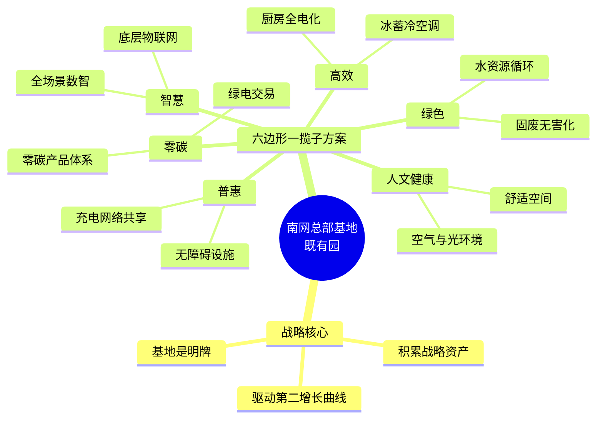

# 南网总部基地既有园世界一流园区六边形一揽子方案（Gemini 3.1版）

核心理念：加快积累战略资产，驱动第二增长曲线；基地是明牌。围绕南网生产科研基地，以真实改造与运营为切入点，打造引领行业的示范标杆。注意，零碳不等于绿色，绿色也不等于高效，各维度需精准发力，相互协同。

### 一、 零碳

零碳的核心在于能源结构的重塑与温室气体排放的绝对抵消。我们严格将“零碳”与“绿色”区分开来，零碳聚焦于碳足迹的消除和碳资产的开发，不涉及非碳类的环境改善。南网总部基地作为央企零碳总部基地的示范区，首要任务是通过绿电交易与碳管理，实现园区整体能源消耗的零碳排，将其转化为可量化的碳资产。

在具体实施路径上，园区全面推行绿色电力消费，并依托分布式屋顶光伏构建基础的零碳能源补给。在此基础上，深度对接碳市场交易规则，将每年的绿电消费转化为切实的减排数据。我们坚决不编造未签约的数字，而是基于现有的绿电购电意向与实际消纳能力，夯实从算碳、降碳到管碳、易碳的全链条业务体系，确保每一度电的来源都具备零碳属性。

在方案商选择与合作上，园区直接联动国家电投广东公司与广东能源集团，通过切实签订的绿色电力交易购电意向协议，保障了园区超大规模的绿电供应。同时，深度部署南网能源公司自主研发的零碳园区产品体系，利用其能碳管理中心，完成对绿电消纳与碳排放数据的精准核算与认证，形成真实有效的碳资产闭环。

通过这一体系，南网总部基地不仅在物理层面上完成了零碳改造，更在战略层面上积累了海量的碳资产数据。这些碳资产将成为驱动第二增长曲线的关键要素，为未来参与全国乃至国际碳交易、输出零碳园区标准奠定坚实基础，让基地的“明牌”效应发挥到极致。

### 二、 绿色

绿色维度的聚焦点是自然生态的保护、资源的循环利用以及环境污染的最小化。与关注碳排放的“零碳”不同，绿色方案强调非能源类资源的综合治理，例如水资源的回收、固体废弃物的处理以及园区内部生物多样性的维护。这是在零碳指标之外，展现央企环保责任与生态共生理念的重要途径。

在既有园区的改造中，我们重点实施水资源综合利用与办公固废的循环再造。通过引入海绵城市的设计理念，对园区部分硬化路面和绿化带进行微改造，实现雨水的自然积存与净化再利用。同时，针对园区产生的大量办公废弃物和厨余垃圾，建立严格的分类、降解与资源化回收体系，确保对周边环境的负担降至最低。

为实现这些绿色目标，我们引入了在资源回收与生态治理领域具有丰富经验的优质方案商。在固废处理与循环经济方面，我们计划与格林美（GEM）等行业领军企业合作，建立标准化的电子废弃物与日常办公固废回收链条；在水资源循环与生态净化改造上，则联动碧水源等水处理专家，部署分布式的中水回用与雨水收集微型系统。

这种彻底的绿色改造，使得南网总部基地突破了传统写字楼的消耗型模式，转变为与自然和谐共生的生态微循环体。这不仅是对国家生态文明建设的直接响应，更是将绿色可持续发展的无形价值，转化为提升企业社会责任品牌这一重要战略资产的必由之路。

### 三、 高效

高效的本质是追求投入产出比的最大化、设备运行的最佳工况以及业务流程的极致流畅。高效绝不等于绿色，一个设备可以极其耗电且不环保，但其工作效率可能很高；我们在高效维度，专注于消除系统冗余、提升机电设施的响应速度和空间使用率，以最低的时间和运行成本维持园区的巅峰运转。

在机电与后勤系统的改造上，基地充分发挥电力行业的专业优势。核心举措包括全面启用冰蓄冷空调系统，利用夜间谷电制冰、白天融冰制冷，大幅削减高峰时段的系统负荷，实现电力资源的极致调度效率。此外，后勤系统已完成厨房全电化改造，淘汰了传统的天然气设备，采用高效率的电磁化加热技术，从根本上提升了后勤运作的整体能效。

在合作厂商方面，园区联合了国内顶尖的楼宇设备制造商来落地高效方案。例如，通过引入美的楼宇科技的高效暖通设备与控制算法，对冰蓄冷系统及常规空调末端进行精细化匹配调优；在全电化厨房设备的替换中，采用沁鑫等商用电磁设备的成熟方案，确保后勤供餐在高峰期依然能够保持极高的出餐效率与能源利用率。

高效维度的深度挖掘，直接为南方电网节约了可观的运营成本，并提升了物业资产的保值增值空间。这种极致的运营效率，构成了基地不可复制的硬核资产。它向外界展示了南网不仅是能源的提供者，更是能源高效应用的终极实践者，以此驱动综合能源服务等第二增长曲线的快速发展。

### 四、 智慧

智慧维度旨在通过底层数据打通、物联网与人工智能技术，赋予园区生命力与自决能力。智慧是对前述零碳、绿色、高效目标的神经中枢支撑，它通过数字孪生和全场景数智化平台，消除信息孤岛，实现从被动响应向主动预测、从人工管理向AI自主调优的跨越。

园区在智慧化改造中，全面铺设感知物联网节点，将电力、安防、环境、通行等海量数据汇聚至统一的底座。依托南网能源的全场景能碳数智化管理平台，我们不仅实现了对园区每一处能耗的实时监控，更通过AI算法模型，对未来的用能趋势进行精准预测，自动下发控制指令，使得整个园区的运行状态始终保持在最优区间。

在智慧底座与生态建设上，我们与一线科技大厂深度绑定。引入华为的智慧园区数字底座（ROMA平台），确保底层设备连接的稳定与数据交换的极速畅通；同时，结合腾讯微瓴等建筑操作系统的先进理念，打造出适配南方电网特色的定制化可视化大屏与移动端管理应用，让园区的每一个微小变化都在数字世界中得到实时映射。

智慧园区的建设，实质上是南方电网在积累宝贵的数据资产与算法资产。这些经过真实复杂场景打磨的数字孪生模型和AI调度算法，将成为南网对外输出智慧城市、智慧能源解决方案的核心武器。基地作为明牌，其智慧化成果将直接赋能整个电网生态，强力驱动智能化业务的第二增长曲线。

### 五、 人文（含健康）

人文与健康维度聚焦于园区内人的真实感受与生理健康，强调空间的服务属性与温度。无论技术多么先进，园区的最终服务对象是员工。此维度致力于打造一个无压、健康、激发创造力的工作环境，通过改善空气、光照与工效学设计，切实提升员工的幸福感。

我们在室内环境中重点推行空气质量的极智管理与健康光环境的重塑。通过部署高精度的环境传感器，实时监测颗粒物、二氧化碳及挥发性有机物浓度，并与新风系统联动，确保办公区域时刻充满新鲜富氧空气。同时，采用节律照明技术，根据一天中的日光变化自动调节室内光源的色温与亮度，保护视力并调节员工的生物钟。

为实现极致的健康体验，园区携手专注于健康人居环境的专业厂商。在空气净化与新风调度方面，引入远大科技集团的洁净新风技术，从源头杜绝室内空气污染；在健康餐饮与高品质后勤服务体验上，引入索迪斯（Sodexo）等国际顶尖的驻场服务商，为员工提供营养均衡的餐食搭配与充满关怀的日常后勤保障。

人文健康的投入，本质上是对企业核心资产即人才的投资。一个充满人文关怀与健康保障的总部基地，能够极大地提升员工的归属感与工作效能，降低流失率。这种隐形的人力资源与文化资产的积累，是支撑南方电网持续创新、开拓第二增长曲线的深层动力源泉。

### 六、 普惠

普惠维度要求园区打破封闭的特权感，强调公平、共享与无障碍，让所有群体都能平等地享受到园区升级带来的红利。这不仅体现在对特殊群体的物理空间关怀，也体现在数字红利的普遍共享以及与周边社区的和谐共融上。

园区在普惠改造中，全面排查并升级了无障碍设施，从平缓的坡道、智能语音盲道到无障碍洗手间与电梯，确保孕妇、伤健人士及年长访客能够畅通无阻。此外，园区内的部分公共服务设施，如光储充一体化充电站，不仅服务于内部员工，更在设计容量范围内通过共享机制惠及周边公众，实现资源的普惠化利用。

在普惠方案的落地中，我们注重引入兼具社会责任感与专业能力的合作伙伴。例如，联合朗程等专业的无障碍设计咨询机构，对园区的物理空间进行彻底的适老化与无障碍优化；在普惠充电网络的建设上，引入广汽能源或特来电的开放式充电运营方案，确保不同品牌、不同车型的电动车都能在园区获得平价、高效的补能体验。

普惠理念的践行，为南方电网赢得了极高的社会声誉与公众信任。这种基于共享与公平积累的品牌资产与社会信用资产，是企业长期稳健发展的护城河。通过普惠机制，基地真正成为了一个融入社会、服务社会的开放型枢纽，让南方电网的发展宗旨在这个物理空间中得到最生动的诠释。

### 三条不做

1. 不做脱离实际用能需求的“运动式”设备替换：坚决避免为了凑“高效”或“零碳”指标，将目前运转良好、寿命未尽且仍具备经济性的机电设备强行报废，所有改造必须基于严格的生命周期成本与投资回报率测算。
2. 不做无真实业务数据支撑的纯展示性“伪智慧”大屏：拒绝建设只有酷炫三维动画但无法实现下发控制、无法与真实子系统双向交互的数字孪生，确保所有数智化平台都能切实解决运营痛点。
3. 不做缺乏履约能力验证的虚假“零碳”包装：坚决抵制在未签订真实绿电交易合同或未获取权威碳注销凭证前，通过编造数字、玩文字游戏来提前宣称“净零排放”，必须以扎实的绿电消纳量和严格的碳核查报告为准绳。