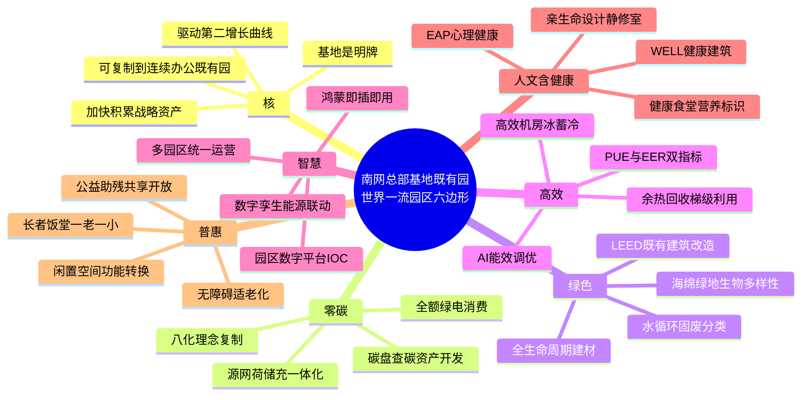

# 南网总部基地既有园 · 世界一流园区六边形一揽子方案（GLM-5.2 路 · 第四轮赛马）

## 核（Core）

加快积累战略资产，驱动第二增长曲线。基地是明牌——南方电网生产科研基地已是国内绿电消费规模最大的央企零碳总部基地（公开报道，未签约数据不引）。第四轮要做的是把"基地"从单点示范升级为**可复制到连续办公既有园**的资产包：一套标准、一套厂商清单、一套不做清单，让南网能源公司的"6 系列 40 产品"在自有既有园先跑通，再外卖。绿色≠高效（绿电不等于低能耗），零碳≠绿色（零碳只看碳，绿色看全生命周期），六边必须分开打分、分开招标、分开核算。

## 思维导图

## 六边

### 一、零碳（Zero Carbon）

**现状**：基地已实现全额绿电消费，但"零碳"止于电这一种能源载体，范围三、冷热负荷、车队燃油尚未全口径入账，碳资产尚未货币化。

**对标**：贵州电力科创园近零碳示范区以"八化"理念落地，是公开可查的"十四五"国家重点研发计划科技示范工程；佛山周转仓把 2008 年老旧仓库改零碳仓库，证明既有园可改。两者均为南网自有，复制阻力最小。

**路径**：先做碳盘查把范围一二三全口径摸清，再以屋顶光伏 + 冰蓄冷 + 柔性负荷 + 绿电交易四件套补齐，最后接入碳资产开发形成"算碳—管碳—易碳—降碳—碳+"闭环。改造不停业，分楼栋滚动。

**点名厂商**：南网能源公司（自有，BOT/BOO/EMC 多模式）、安科瑞（Acrel-2000MG 零碳虚拟电厂与能碳平台）、固德威（智慧微电网光储直柔）、协鑫能科（鑫零碳全生命周期服务）。

**三条不做**：不把绿电消费等同于零碳认证；不采购无法接入碳管理平台的孤岛式光伏；不在范围三未盘查前对外宣称"碳中和"。

### 二、绿色（Green）

**现状**：基地绿化率高、有海绵设施，但绿色停留在景观层，建材全生命周期、室内环境质量、生物多样性均未纳入既有园改造评分。

**对标**：嘉兴城东湿地公园近零碳园区以"光伏建筑一体化 + 光储直柔 + 智慧能源管理"入选市级双碳案例，强调既有建筑改造的可复制模板；上海绿智汇 WELL 办公空间把绿色与健康分离打分。

**路径**：以 LEED 既有建筑运营与维护（EBOM）为骨架，分项做屋顶绿化 / 垂直绿墙 / 雨水回用 / 固废分类 / 室内空气监测，每项独立验收独立计分，避免"一绿遮百丑"。

**点名厂商**：建学国际 / 近零建筑科技（既有建筑光伏一体化与光储直柔）、BRE 中国（BREEAM 既有建筑评估）、SGS（室内环境与全生命周期碳）、本地园林院所（海绵与生物多样性）。

**三条不做**：不把"零碳"成绩单直接折算为"绿色"得分；不做仅为评奖而不可运维的景观水系；不引入高耗水外来树种破坏本地生物多样性。

### 三、高效（Efficient）

**现状**：办公园区能耗以空调、机房、照明为主，老旧机房 PUE 偏高、空调系统性能逐年衰减，但"高效"长期被"零碳"叙事吞并，缺独立指标。

**对标**：深圳联通同乐机房由维谛技术把 PUE 从 1.8 降至 1.27；南京德基广场由天加把综合能效从 3.2 提到 5.6（能效提升 75%，公开报道）；重庆广阳岛由美的楼宇科技实现暖通节能率 52.3%。均为既有改造不停业案例。

**路径**：高效机房 + 冰蓄冷 + 余热回收 + AI 主动寻优四件套，按楼栋分计量、按系统分 PUE/EER，先诊断后改造，节能效益分享（EMC）回本再推广。

**点名厂商**：维谛技术 Vertiv（老旧机房不停业改造）、天加（高效机房 Optseek 平台）、美的楼宇科技（鲲禹冰蓄冷与地源热泵）、正泰能效（区域能源站与动态蓄冰）。

**三条不做**：不把"绿电覆盖"当作"高效"成绩；不做无分项计量的整体节能改造（无法验证）；不采购无 AI 调优、仅靠定频运行的"高效"主机。

### 四、智慧（Smart）

**现状**：基地已有信息化系统，但各子系统烟囱林立，缺统一数字底座，多园区无法统一运营，数据未资产化。

**对标**：河套深港科创合作区以华为智慧园区方案建 IOC，实现"产业空间可视、园区管理可管、应急可控"；上海临港桃浦由腾讯数字孪生做建筑能源 AI 联动入选"数字技术赋能碳中和实践案例"；重庆两路果园港以华为园区数字平台建"2+1+1+5"架构。

**路径**：先建园区数字平台（IOC）做数据融合，再上数字孪生做能源—环境—安防联动，最后以鸿蒙终端即插即用降低集成成本，向"总部分支多园区统一运营"演进。

**点名厂商**：华为（园区数字平台 + F5G-A 全光网 + 鸿蒙终端）、腾讯云（数字孪生与能源 AI）、阿里云（园区大脑与数据中台）、五一视界（BIM+GIS 既有园改造孪生）。

**三条不做**：不做不开放数据接口的封闭 IOC（锁死厂商）；不做与能源系统不联动的"智慧"展示大屏；不为单点炫技采购无法复用到分支园区的定制硬件。

### 五、人文（含健康，Humanistic + Health）

**现状**：基地有食堂、健身房、医务室，但缺健康建筑认证、缺心理健康制度、缺亲生命设计，"人文"靠活动不靠空间。

**对标**：上海绿智汇 WELL 金级办公空间从空气、水、光、营养、健身、精神、舒适七维设计；竹中工务店（Takenaka）既有办公改造以 WELL 为索引设睡眠专用室与亲生命布局；WELL 已与 GRI/GRESB 双向对接，可进 ESG。

**路径**：以 WELL v2 十大概念为 checklist 既有园改造，优先做空气监测 + 节律照明 + 静修室 + 健康食堂营养标识 + EAP 心理服务，分项落地分项认证，不强求一次性全楼铂金。

**点名厂商**：IWBI（WELL 认证主体）、竹中工务店 Takenaka（既有办公 WELL 改造）、德尔福 / 美的楼宇科技（节律照明与个体舒适空调）、本地 EAP 服务商（心理健康）。

**三条不做**：不把"绿色建筑"等同于"健康建筑"（LEED 不等于 WELL）；不做无空气数据公开的"健康"宣传；不设只拍照不开放使用的冥想室样板间。

### 六、普惠（Inclusive）

**现状**：基地以办公为主，对周边社区、残障、长者、一老一小基本封闭，闲置空间未盘活，社会价值未货币化。

**对标**：深圳福田国投健康长者公寓把闲置办公楼改 252 床养老公寓，是深圳首个"商办改养老"示范；北京汇爱大厦把融信大厦改残疾人服务中心，获北京城市更新优秀案例；广州花都红砖坊把危房改普惠智慧养老并嵌公益"星星幸福舱"。

**路径**：把基地既有园的闲置裙楼 / 旧宿舍 / 旧食堂做功能转换，嵌入长者饭堂、社区无障碍示范、公益助残工坊、面向周边学校的开放共享空间，形成"政府统筹 + 国企运作 + 社会资本技术赋能"的多元共治，沉淀为南网可外卖的"普惠既有园改造产品"。

**点名厂商**：北京建院（汇爱大厦无障碍改造设计）、GN 栖城设计（超高层存量改康养）、广州安然健康（医养无缝衔接运营）、本地无障碍与适老化产品商。

**三条不做**：不做只为内部员工、不向社区开放的"普惠"样板；不做无运营方接手的纯硬件堆砌适老化改造；不在未做无障碍整体评估前单点改造某栋楼。

## 收口

六边分开打分、分开招标、分开核算，核是"可复制到连续办公既有园"的资产包。每边四段、点名厂商、三条不做，构成第四轮赛马的 GLM-5.2 提案。文中厂商与案例均来自公开报道，未签约数据不引、不编。
