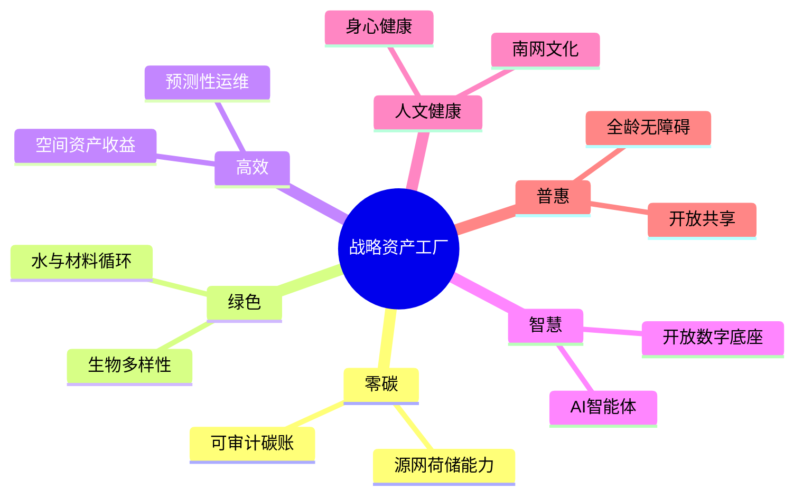

# 南网总部基地：世界一流园区「六边形」一揽子方案

## 核心判断

基地不是再做一次“智慧化装修”，而是把南网最确定的场景变成战略资产工厂：沉淀可审计的碳数据、可调度的负荷、可复用的运营模型、可验证的技术标准与可信体验，再输出为园区能源服务、标准认证、软硬一体产品和示范咨询，驱动第二增长曲线。公开资料显示，生产科研综合基地是已运行的多楼宇复合园区，兼有总部办公、调度、科研、会议、档案及后勤，正适合边运营边改造、边验证边产品化。

六边共用一条“资产脊柱”：统一空间—设备—能源—碳—人群事件模型，原系统以开放接口接入，数据分级分域；每个项目必须同时交付物理改造、数据资产、算法/规则、标准作业书和可复制产品包。设跨部门“园区产品委员会”，安全生产一票否决，以基线—小试—核验—复制为闸门；供应商均为公开遴选候选，不代表已签约。

## 1. 零碳｜把电力专长变成可交易、可复制的能力

**定义。** 零碳回答“排了多少、由谁减、何时清零”，不等于多种树。先按国家零碳园区方法明确组织边界与直接、外购电热等排放边界，建立逐时碳账、凭证链和第三方核验机制；未核验前只称“减碳”，不贴零碳标签。

**建设。** 对冷站、数据机房、照明、充电、储能及可用屋面做普查，先能效、再电气化、再本地可再生能源与绿电绿证，最后处理难减排残余；把充换电、空调蓄冷等柔性负荷接入安全隔离的源网荷储沙盒，调度核心业务不参与冒险试验。

**资产/增长。** 沉淀园区级MRV碳账本、负荷资源图谱、预测调度算法和绿电溯源规则；经实证后封装为“办公园区能碳托管”“柔性负荷聚合”“零碳园区体检”，成为南网面向政府、产业园和客户侧的新服务样板。

**标杆/候选。** 鄂尔多斯零碳产业园验证了远景与园区共建智能能碳平台和新型电力系统的路径。候选组合：南网自有技术体系牵头，远景科技做EnOS/能碳能力，华为数字能源或阳光电源做光储充，CQC/中国建研院负责独立评价，避免同一方既建设又发证。

## 2. 绿色｜经营生态、水、材料，而非只经营能耗

**定义。** 绿色回答“园区是否与自然共生、资源是否循环”，不等于高效。建立树木与栖息地、水量水质、材料健康、废弃物去向四本账；保留成熟树、减少硬质铺装、控制光噪与热岛，形成亚热带园区生态基线。

**建设。** 以海绵化微更新串联下凹绿地、雨水花园、透水步道和回用水；食堂厨余、办公耗材、装修拆除物分类追踪；采购写入低挥发材料、可维修和回收条款。先做一条“凉廊—雨庭—生境岛”可感知样板，再按监测结果扩展。

**资产/增长。** 输出“既有园区自然资本台账、循环采购清单、海绵微改造标准包”，并把生态监测与用能数据组合成ESG证据服务；这类方法可复制到变电站、营业厅与生产基地，扩展绿色基础设施咨询。

**标杆/候选。** Apple Park公开展示了耐旱本土植物、开放空间、雨水与再生水协同的系统思路，但广州应做本地化而非复制形态。候选：奥雅纳做水与资源闭环，中国建研院做绿色性能，AECOM/土人设计做生态景观，威立雅做水与废弃物运营。

## 3. 高效｜让每平方米、每台设备持续创造价值

**定义。** 高效回答“同等安全与体验下，资源投入是否更少、周转是否更快”，不是绿色的同义词。以空间周转、工单闭环、设备健康、能耗强度和服务满意度建立基线，拒绝只建IOC大屏。

**建设。** 打通会议室、工位、停车、餐饮、访客与工单预约；用实际占用驱动照明空调；给关键机电设备建立故障模式、维护策略和备件编码，推进冷站群控与预测性维护。所有自动控制保留人工接管、告警和回退。

**资产/增长。** 形成“空间需求预测模型、设备健康模型、运营SOP库、改造前后M&V证据”，先降低基地全生命周期成本，再产品化为总部型园区精益运营服务；收益按核验后的节省与服务质量设计，而非按设备采购额。

**标杆/候选。** 西门子Building X公开提供建筑运营、能源、维护及开放API，适合作为能力参照。候选：西门子或施耐德电气负责楼控与能效，江森自控做暖通优化，IBM Maximo或国内成熟EAM承接资产维护；要求协议开放、模型和数据归南网。

## 4. 智慧｜从系统堆叠升级为可演进的园区操作系统

**定义。** 智慧回答“能否感知、理解、预测并闭环行动”。统一身份、空间编码、设备物模型、事件总线和API目录；数字孪生只承载业务对象与实时状态，不追求昂贵但不可计算的三维皮肤。

**建设。** 首批只做高价值闭环：设备告警自动归因并派单、会议与环境联动、峰荷预测及柔性调节、应急态势联动、员工问事办事智能体。模型输出标注来源与置信度，高风险动作须人工确认，敏感数据本地化并最小授权。

**资产/增长。** 把异构接入适配器、园区知识图谱、场景编排器、评测集和安全治理规则沉淀为南网“园区OS”；基地成为新技术长期试验场，形成联合创新、生态认证、方案输出三类增长接口。

**标杆/候选。** 华为云“数游溪村”已展示实景三维与空间计算的园区应用，阿里云公开了园区IoT孪生建模路径。候选：华为/阿里云提供云边底座，海康威视或大华承接视频物联，广联达连接BIM资产；核心数据模型与编排权不得被单一厂商锁定。

## 5. 人文（含健康）｜把组织文化变成每日可体验的生产力

**定义。** 人文不是装饰展陈，健康也不止健身房。围绕空气、水、光、声、热舒适、运动、营养、心理安全和组织连接建立体验旅程；同时把“万家灯火、南网情深”转译为员工与访客能参与的电力文明叙事。

**建设。** 优先修复眩光、噪声、久坐、绕行和午休等高频痛点；设置步行环、安静恢复点、母婴与照护空间、健康餐信息和心理支持入口。档案、调度与科研故事通过口述史、可变展览和开放课堂进入公共节点。

**资产/增长。** 建立匿名化环境—体验关联数据、健康空间设计导则、文化内容库和活动运营IP；对外可形成能源科普研学、行业会议、创新发布和人才品牌平台，让总部从成本中心变成关系与知识资产入口。

**标杆/候选。** 广联达西安大厦的WELL铂金实践覆盖运动、母婴与共享休闲。候选：IWBI认可顾问/奥雅纳做健康性能，Gensler或本土优秀团队做工作场所，Keep企业服务/专业EAP机构做持续运营；不得采集个人健康数据换“关怀”。

## 6. 普惠｜让园区价值被更多人公平获得

**定义。** 普惠不是免费开放，而是员工、外协、访客、残障人士、老人、儿童及数字弱势群体都能有尊严地通行、获取信息和使用服务。安全区分级开放，物理、信息、服务三类无障碍同步验收。

**建设。** 先由真实用户走查连续无障碍链：到达、落客、通行、电梯、卫生间、餐饮、会议与疏散；数字端提供大字、读屏、字幕、手语/文字替代和人工兜底。将会议中心、文体设施、科普内容按时段向社区与产业伙伴预约共享。

**资产/增长。** 沉淀全龄友好导则、无障碍审计工具、开放空间预约规则和公共价值指标；输出到营业厅、客户中心与产业园，形成“能源服务可及性”标准与央企社会价值品牌。

**标杆/候选。** 腾讯前海总部联合中国残联及高校院所编制全龄友好无障碍导则，覆盖设施、信息与服务。候选：中国助残志愿者协会、北京市建筑设计研究院/清华设计院做共创审查，科大讯飞做多模态交互；最终验收必须包含残障用户实测。

## 推进与三条“不做”

先做全园基线和数据治理，再选“一楼一庭一条能源回路”形成六边最小闭环；核验后复制到多楼宇，最后才对外产品化。采购按“结果指标+开放接口+资产归属+退出机制”拆包，任何节能、减碳、健康收益只采用实测或第三方核验值，不预写承诺数字。

1. **不做概念拼盘：** 不把光伏、绿化、大屏混称零碳，也不把绿色与高效合并考核。
2. **不做厂商黑箱：** 不采购封闭超级平台，不让设备协议、主数据、算法规则和运维知识随合同到期流失。
3. **不做形象先行：** 不先定认证牌匾和减排比例；不牺牲电网生产安全、个人隐私与弱势群体体验换展示效果。

## 公开案例与依据

- [南方电网生产科研综合基地物业管理服务招标公告](https://www.bidding.csg.cn/zbgg/1200327500.jhtml)
- [国家发展改革委《关于开展零碳园区建设的通知》](https://www.ndrc.gov.cn/xxgk/zcfb/tz/202507/t20250708_1399055_ext.html)
- [鄂尔多斯市政府：鄂尔多斯零碳产业园](https://www.ordos.gov.cn/zzms/jrgz/202501/t20250107_3755597.html)
- [Apple：Apple Park环境实践](https://www.apple.com/newsroom/2017/04/apple-celebrates-earth-day/)
- [西门子：Building X建筑运营平台](https://www.siemens.com/cn/zh/products/buildings.html)
- [深圳特区报：华为云“数游溪村”案例](https://sztqb.sznews.com/PC/content/202310/22/content_3132974.html)
- [阿里云：IoT孪生引擎园区路径](https://help.aliyun.com/zh/iot/service-introduction-6)
- [广联达：西安大厦WELL健康建筑实践](https://www.glodon.com/news/1323.html)
- [北京建院：腾讯前海总部全龄友好无障碍导则](https://www.biad.com.cn/view/id/145/)
