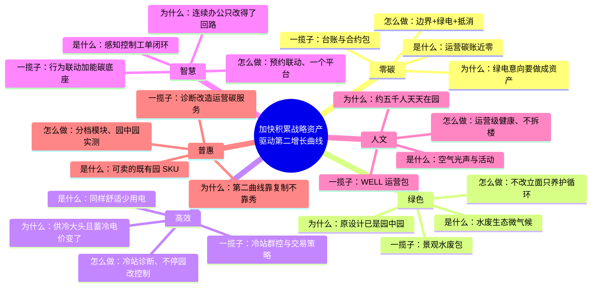

# 南网总部基地既有园：六边形战士一揽子

核用钱课题原话：**加快积累战略资产，驱动“第二增长曲线”**。基地是南网能源能碳一体化第二曲线的明牌——不是装修秀场，是把连续办公既有园跑通的方法、数据、产品收成可卖的母本。

筛子一条：只取能在持续办公、外立面不可大改、屋顶光伏有限、设备满十年未报废的既有园落地的东西。Apple Park 自然通风九个月、The Edge 百米含水层蓄热、雄安整园换皮，一律不搬。零碳管账本，绿色管生态，高效管少用电；三边不得串味。

## 零碳

是什么。零碳管的是运营碳账：核算边界、绿电绿证、剩余抵消。它不是绿化，也不是省电。Apple 2018 年宣布全球设施 100% 可再生电力，Cupertino 总部屋顶光伏只是一块，大头是场外采购与微网调度（Apple Newsroom，2018-04-09）。

为什么。发改委 2022 年报道，后勤管理中心与国家电投广东公司、广东能源集团签订绿电购电意向，年度超 6000 万千瓦时，目标生产科研基地全额绿电消费。零碳边是把已有交易做成可核证战略资产，而不是再铺一层宣传光伏。

怎么做。先钉机房进不进核算边界；绿电绿证按年滚动；余量走合规抵消。清华会中口述屋顶有限、现状约 2 点几兆瓦，场地光伏贡献只在个位，不能当主路径。雄安宣讲材料里本体与光伏做完仍有约四成靠交易，结构同此。

一揽子。能碳台账、绿电合约包、抵消规则。对标 Apple Park「场内发电 + 场外可再生」、中移信息港「绿电为主、可再生为辅」的企业口径。不把任何机房写成全国首个。

## 绿色

是什么。绿色管水、废弃物、生物多样性、材料与微气候，与千瓦时无关。Apple Park 把场地从约 20% 绿地翻到 80%，种植 9000 余棵乡土树，并用邻市再生水灌溉（WorldGBC；Apple 公开材料）。西门子埃尔兰根校园把生物多样性、屋顶与停车楼绿化写进运营，而不是写进电表（Siemens，2022-12）。

为什么。本园由 gmp 设计，中庭、栈桥、花岗岩遮阳立柱已在，主楼与会议中心获 LEED-NC 金级（gmp / gooood）。绿色边是养护与循环，不是再造一座飞船。

怎么做。外立面不动。补乡土植被与海绵微地形；分质用水、厨余与办公废弃物路径；机房余热优先供生活热水。彭博伦敦欧洲总部的活体墙与 BREEAM In-Use Outstanding，证明既有运营也能做生态分，不必新建（Bloomberg，2023-03-30）。

一揽子。景观运维包 + 水废循环包。对标 Apple Park 再生水逻辑、彭博 In-Use、松山湖「无废园区」细胞创建（东莞市生态环境局）。绿化面积不计入碳账。

## 高效

是什么。高效是同样舒适少用电。BREEAM 案例写 The Edge 较同类办公少用电约 70%，靠人员在场才供能，不是靠买绿证。中移园建资料宣称信息港 G61 改造节电率 15.9%，靠控制而不是改立面（新华网 2025-11-26；中国网 2025-07-04）。

为什么。广州供冷是大头。会中说明既有冰蓄冷原靠固定低谷电价，国家已取消固定低谷、广东细则转向约 15 分钟级实时电价，旧省钱逻辑会失效。这件事是南网主场，不是可选项。

怎么做。先诊断冷站与水系统，不换主机先挖会中估算的 10%–20% 量级，数字待实测，不写入指标。照明、风机盘管与会议室预约联动。蓄冷策略对接交易系统。园中园分区试点，约 5000 人持续办公，不停园、不照搬清华暑假断电。

一揽子。冷站诊断、末端群控、蓄冷交易策略。对标 The Edge「无人则近零」、信息港预约关灯关风盘、施耐德 Aspiria 既有园 EcoStruxure 改造（Schneider 案例）。省下的电进入高效边，不改记为零碳。

## 智慧

是什么。智慧是感知—控制—工单闭环，是神经不是目的。Signify 在 The Edge 用近 6500 套互联灯具、其中约 3000 套带传感器做数字天花，设施人员看占用再决定清扫与维保（Interact Office 案例）。中移 M-PARK 把人员、设备、能耗、空间收成产品，获鼎新杯（人民政协网，2024-09-29）。

为什么。连续办公园改得动的是控制回路，不是结构。一个平台两类功能：园内行为联动，园外柔性与碳账。两端分建，后期必二次集成。

怎么做。会议室—照明—末端先闭环；地块到楼层四级计量；本地化部署并按本园设备重训。不新建第二套展览大屏。华为 2019 年可持续发展报告称，智慧园区能耗动态控制在自有园节能量超过 15%，价值在策略，不在品牌墙。

一揽子。行为联动模块 + 能碳底座。对标 Philips Interact / The Edge、M-PARK / 信息港、Schneider EcoStruxure、Siemens Desigo CC。南网侧用已有「启成 + 看能」收口，不另起炉灶。

## 人文（含健康）

是什么。人文管空气、光、声、活动与可调节工位，对象是人。WELL 与 WELL Health-Safety 管运营政策，不要求拆楼。彭博 2022 年 1 月宣布全球超 90% 办公面积获 WELL Health-Safety Rating（Bloomberg 新闻稿）。The Edge 用 App 调光调温，是舒适，不是碳。

为什么。园区约 5000 人持续办公（会中口述）。总部该让人看见的边是健康与尊严，不能并进智慧大屏，也不能用绿植照片替代新风。

怎么做。新风与二氧化碳监测、照明色温、步行与食堂路径、可预约的安静 / 协作分区。外立面与历史风貌不动。健康认证走运营级，不走大拆大建。

一揽子。运营级健康包：政策、监测、场景。对标 Bloomberg 组合认证、The Edge 个性化工位、Apple Park 步道与运动设施的「可步行园」。人边独立验收，不与节电率混报。

## 普惠

是什么。普惠是把本园做成可报价、可分期、可给别的连续办公既有园用的 SKU。中移把信息港运营收成绿智楼宇「1+3+18+N」与低 / 中 / 高三档（企业资料）。施耐德 Grenoble IntenCity 是 EcoStruxure 的可参观母本，WorldGBC 记其运营净零与 LEED Zero Carbon。华为松山湖屋顶光伏先自用验证，再变成 FusionSolar 产品（华为《赢》）。

为什么。核在第二曲线。南网能源 2025 年 10 月发布 6 系列 40 个零碳园区产品（证券时报 2025-10-10）。总部基地要补的是「连续办公既有园」这一档。秀场做不了资产，产品才能驱动增长。

怎么做。诊断分档 → 模块报价 → 园中园实测 → 标准工法。轻资产：平台 + 服务 + 科技产品。不把本园投资额写成行业标杆。会中提到的 1 号楼后空地只作比选场地，稿中未见立项。

一揽子。办公既有园产品包：诊断、改造、运营、碳服务。对标 M-PARK 产品化、IntenCity 母本逻辑、南网能源已发布产品体系。卖得出去，核才立得住。

## 六边对照（防串味）

| 边 | 验收看什么 | 不看什么 |
| --- | --- | --- |
| 零碳 | 碳账、绿电、抵消 | 绿化率、节电率 |
| 绿色 | 水废、生物、微气候 | 碳账、千瓦时 |
| 高效 | 同样舒适下少用电 | 绿证、传感器个数 |
| 智慧 | 闭环是否跑通 | 展览大屏、品牌墙 |
| 人文 | 空气、光、声、人 | App 个数、节电率 |
| 普惠 | 能否分档报价、复制到下一座连续办公既有园 | 本园是否好看、是否全国首个 |

本园一揽子只此一份：台账合约包、景观水废包、冷站群控与交易策略、行为联动加能碳底座、WELL 运营包、办公既有园产品包。六包可拆开卖，不可拆开定义。

## 三条不做

1. 不做「全国首个零碳机房」对外叙事。该提法是会内争取方向，稿中未见申报、受理主体与评价机构。
2. 不做六边串味。绿电不是绿化，省电不是零碳，传感器不是人文，总部秀场不是第二曲线。
3. 不做停园换皮、编造投资、把未签约写成合作、把会中口述大数写成验收指标。

## 来源

- Apple Newsroom，2018-04-09，全球设施 100% 可再生电力 / Apple Park 屋顶光伏与微网。
- WorldGBC，Apple Park、IntenCity 案例页。
- BREEAM，The Edge Amsterdam 案例（约 70% 少用电、人员在场供能）。
- Signify Interact Office，The Edge 互联照明案例。
- Bloomberg，2022-01-13 WELL Health-Safety；2023-03-30 LEED/BREEAM 与 In-Use Outstanding。
- Siemens，2022-12-19，Campus Erlangen 可持续背景稿。
- Schneider Electric，Aspiria Campus EcoStruxure 案例。
- 国家发改委，2022-11-23，南网绿电购电意向与生产科研基地。
- gmp / gooood，南方电网生产科研综合基地（建设周期 2011–2016，LEED-NC 金级）。
- 新华网 2025-11-26、中国网 2025-07-04，中移信息港照明空调联动、余热、宣称节能量。
- 人民政协网 2024-09-29，M-PARK 鼎新杯。
- 华为 2019 可持续发展报告；《赢》FusionSolar 松山湖自用验证。
- 东莞市生态环境局，松山湖入选国家「无废园区」典型案例。
- 证券时报 2025-10-10，南网能源零碳园区产品体系（6 系列 40 产品）；生产科研基地能碳管理中心 + 绿电交易，央企总部近零碳示范。
- 建科院 2026-08 宣讲材料、中移园建 2026-07 产品资料、2026-08-21 清华会谈纪要：台阶、口述约束与估算均未经本方案核证，只作量级参照，不进入指标。
