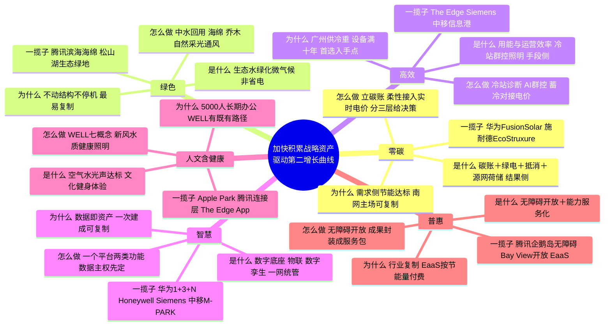

# 南网总部基地既有园区 · 六边形战士一揽子方案（Opus 4.8 路）

> 核：钱朝阳课题原话「加快积累战略资产，驱动"第二增长曲线"」。总部基地是南网能源"能碳一体化"第二曲线的**明牌**——先内部验证、再行业复制，不是曲线本身。全案只取可复制到"连续办公既有园"的东西，不做新建盆景。

**一条贯穿线**：六边每一条的验收口径都不是"这栋楼多好看"，而是"跑通后能不能变成一件可卖给别的连续办公既有园的战略资产"。因此全案买设备、买平台、买认证、买服务，**不买主笔**——主笔一旦外包，资产就归了咨询方；集成与主笔由南网能源自持，这才是"加快积累战略资产"。

---

## 一、零碳

**是什么。** 把园区碳排放算清、减下去、补到零，靠碳账本＋节能＋绿电＋抵消＋源网荷储，是"结果侧"的达标口径——不等于生态好看（绿色），也不等于单纯省电（高效）。

**为什么是它。** 广州供冷重、屋顶光伏有限、立面风貌不可大改（北京调研报告口述），本地发电贡献只在个位数量级，达标主力必然落在需求侧节能＋绿电交易＋抵消，这正是南网数字电网、绿电交易与源网荷储的主场，验证一次即可复制给同类既有园。

**怎么做。** 先立园区级碳账本与核算边界（先厘清数据机房是否计入）；把光伏、储能、蓄冷做成可调柔性资源接入实时电价；抵消走绿电交易；指标对住建部《零碳建筑技术标准》近零碳一档校核，分低碳/近零碳/碳中和三层给领导决策，不机械套零碳。

**一揽子方案。** 光伏参照华为 FusionSolar（自家松山湖屋顶 2012 年起验证、南方工厂样板点 17.5MW，来源：华为数字能源样板点）、能碳与微网参照施耐德 EcoStruxure Microgrid（来源：Schneider）。能买：光伏 EPC、储能、能碳核算平台、绿电交易与抵消服务。**战略资产＝一套可复用的园区碳账本与能碳调度模型。**

## 二、绿色（≠高效）

**是什么。** 绿色是生态环境质量——水、绿化、材料、微气候、自然采光通风，衡量的是园区对自然与人的友好度，与省不省电是两件事。

**为什么是它。** 既有园区里最易被忽略又最可复制的正是这层：不动主体结构、不靠大停机就能改，且直接影响体感与对外形象。Apple Park 把 80% 用地变绿地、种 9000 余棵耐旱本地乔木、主楼一年约九个月靠自然通风免空调（来源：Apple Newsroom／维基百科）；Google Bay View 做到净正水、雨污全回用（来源：Google Blog）——都是"绿色"而非"省电"的示范。

**怎么做。** 做中水/雨水回用闭环、透水铺装与海绵、乔木与垂直绿化改善微气候、优化自然采光通风；立面受风貌约束处，以庭院、半开放空间与植被替代硬改。

**一揽子方案。** 参照腾讯滨海大厦"海绵城市"空中花园与循环系统（来源：WSP／腾讯云）、华为松山湖依湖而建的生态绿地（来源：华为）。能买：雨水/中水回用系统、透水铺装、绿化与遮阳系统。**战略资产＝既有园区微气候与水循环改造模块**（景观集成自持，不买主笔）。

## 三、高效

**是什么。** 高效是用能与运营效率——同样服务用更少的能与人，核心是冷站、空调群控、照明与设备运维，是"手段侧"：既不等于零碳的结果，也不等于绿色的生态。

**为什么是它。** 广州供冷负荷重、主设备 2016 年投运已满十年、5000 人持续办公（北京调研报告），冷站与空调是目前唯一有量级支撑的入手点，且不换主机即可节能；这类既有园区节能技改可复制性最高。

**怎么做。** 先做冷站与水系统深度诊断取实测基线，再上 AI 群控、变频与末端联动；照明走 PoE 与"人来灯亮、人走灯灭"；把蓄冷控制与实时电价对接（国家取消固定低谷后原省钱逻辑将失效，北京调研报告）。

**一揽子方案。** 参照 The Edge——较同类办公省电约 70%、地下含水层蓄能＋热泵、Philips PoE 照明省电约 50%（来源：BREEAM／Philips 案例）；Siemens Building X Comfort AI 某项目月省能约 6.4%（来源：Siemens）；中移信息港照明空调与会议预约联动、数据中心余热经热泵供办公（来源：新华网）。能买：冷站 AI 群控、高效机组、变频、PoE 照明、诊断与合同能源管理服务。**战略资产＝既有园区冷站诊断＋AI 群控可复制包。**

## 四、智慧

**是什么。** 智慧是园区的数字底座——物联感知、数字孪生、一网统管，把设备、能耗、空间、人流的数据汇起来，可视可管可控。

**为什么是它。** 数据本身就是战略资产；底座一次建成、模型一次训好，就能复制到别的园区，是"能碳一体化"产品化的地基。

**怎么做。** 按"一个平台、两类功能"统一规划——园内侧办公与设备联动（对内），园外侧与电网互动、碳核算（对外），避免分头建设后二次集成；本地化部署、数据归属与合规先定（北京调研报告）。

**一揽子方案。** 参照华为智慧园区"1+3+N"数字底座＋CIM 数字孪生＋好望（来源：华为）、The Edge 数千盏含传感灯具组成的"数字天花板"＋Mapiq 工位 App（来源：BREEAM／Philips）；平台层可比选 Honeywell Forge（基于 Tridium Niagara，装机超百万，来源：Honeywell／Memoori）、Siemens Building X、中移 M-PARK。能买：物联底座、数字孪生、一网统管、设备工单。**战略资产＝园区数字底座与数据资产**（数据主权自持，不买主笔）。

## 五、人文（含健康）

**是什么。** 人文与健康是把园区做成对人友好的地方——室内空气/水/光/声达健康标准，加上文化、社交、健身与体验空间。

**为什么是它。** 5000 人长期在此办公，健康与体验直接关系效率与人才；WELL 等健康标准对既有办公有专门达标路径（如以 CO₂ 监测替代设计文档、每三年复审、第三方现场核验，来源：IWBI），复制性强。

**怎么做。** 以 WELL v2 七概念（空气、水、营养、光、健身、舒适、心理）为清单，做新风净化、水质、健康照明、噪声治理，配健身与休憩空间；引入可个性化调节的工位环境。

**一揽子方案。** 参照 Apple Park 十万平方英尺健身中心与步道（来源：Apple）、腾讯滨海大厦文化/健康/知识三大连接层与 IT 机房余热供泳池（来源：WSP／腾讯云）、The Edge 手机 App 个性化调光调温（来源：Philips）。能买：新风与空气净化、水质、健康照明、声环境改造、WELL 咨询与认证。**战略资产＝WELL 既有办公改造可复制清单。**

## 六、普惠

**是什么。** 普惠有两层——对内是无障碍通用设计与公共开放，对外是把跑通的能力做成买得起的服务，让没有资本金的既有园区也能上零碳。

**为什么是它。** 这正对第二曲线的"行业复制"：把总部基地验证过的能碳一体化，用合同能源管理/能源即服务（EaaS）的轻资产模式产品化，客户按节能量付费即可享有——把"战略资产"变成可持续收入。

**怎么做。** 园内做全域无障碍、部分空间对公众开放（科普/展示）；对外把六边成果封装成模块化、可计量、成效可验证的服务包，以合同能源管理落地，南网能源当集成方与主笔。

**一揽子方案。** 无障碍与公众开放参照腾讯企鹅岛无障碍环境、科技博物馆与 04 街坊净零碳园区认证（来源：Arcadis／腾讯）、Google Bay View 向公众开放的湾区步道与湿地（来源：Google）；服务化模式参照 EaaS/ESCO 按节能量付费（来源：Facilities Dive）。能买：无障碍设施、公共开放空间改造，以及把方案服务化、可计量的能力。**战略资产＝能碳一体化服务产品——第二曲线的明牌。**

---

## 三条不做

1. **不做新建盆景。** 只做连续办公既有园区可复制的模块化、增量、可逆改造，不为好看新建示范单体；凡不能复制给同类园区的一律不投。
2. **不做成片停机的休克式大改。** 5000 人持续办公、主设备未到报废年限、立面风貌不可大改（北京调研报告），一律走园中园分区试点、先取实测基线再定指标。
3. **不抢帽子、不编数字、不买主笔。** 对外不使用"全国首个零碳机房"等未落地定调，不编投资额、不写未签约合作；集成与主笔由南网能源自持，只买设备/平台/认证/服务，避免战略资产外流。
