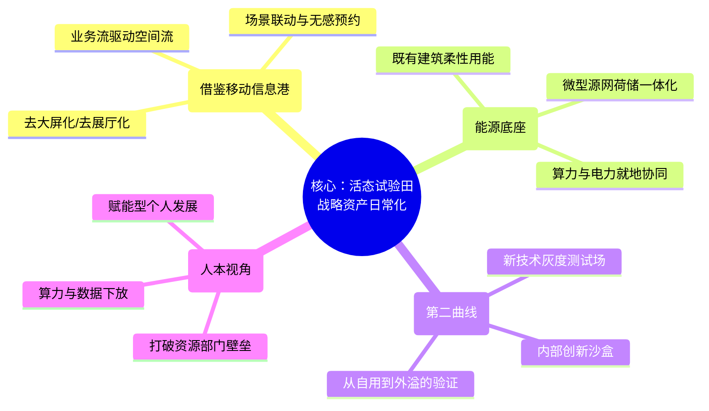

# 独立顶层设计：南网总部既有园升级方案（“活态试验田”架构）

作为独立机构，我们认为既有园区的升级不应是推倒重来的物理堆砌，也不应是宏大战略概念的生硬套用。V3方案之所以未获认可，可能在于其过度包装了“卖点”（如EaaS、SKU），而忽略了**既有园区作为企业真实运转载体**的本质。

能源公司作为方案起草方，应当跳出“卖方案”的乙方思维，站在南网的立场，将总部基地定义为：**南网战略资产的“活态试验田”（Living Lab）**。

## 一、 核心理念（核）：从“管理对象”到“战略试验田”

我们主张放弃原有的“国家-南网-资产”三层嵌套核，改为**“内生驱动”单核**。

既有园区的最大价值在于其真实性：真实的连续办公场景、真实的人流、真实的能耗。因此，顶层设计的核心是：**将南网的“六网协同”与“算电协同”等宏大战略，率先在自己的大院里完成“微缩”与“日常化”**。园区不再是被动管理的物业，而是第二增长曲线在推向市场前，进行灰度测试、打磨体验的“首发阵地”。

## 二、 架构脑图（四边切法）

我们不采用六边形，而是基于既有园区的物理与数字属性，提出“四维激活”架构：

## 三、 空间与业务解法：隐形与联动

借鉴北京调研（中国移动信息港、建科院）的经验，既有园升级应坚决**“去展厅化”**。
不搞为了展示而存在的数据大屏（M-PARK的教训），而是追求**“隐形智慧”**。通过底层数据的打通，实现会议室预约、空调照明控制、访客通行、工位调度的无感联动。智慧不体现在屏幕上，而体现在“人走灯灭、会前预冷、随需而动”的极致顺滑体验中。

---

## 四、 专节：重构中国语境下的“普惠”

在南网总部的语境下，我们必须重新定义“普惠”。它既不是商业模式（投资收益/卖SKU），也不能仅仅停留在口号式的“人人参与、人人受益”。

### 1. 我们的主张：能力平权（赋能型普惠）

在中国语境和科技大厂/能源巨头的背景下，真正的普惠是**“能力平权”**。
在传统企业中，最优质的战略资产（如强大的算力、海量的业务数据、先进的零碳技术）往往被锁定在机房、研发中心或少数特权部门。**我们定义的普惠，是指总部园区利用“算电协同”的红利，将这些高门槛的战略资产“工具化”、“桌面化”，无差别地赋予园区内的每一个个体（包括普通员工、外包人员、生态伙伴）。**

*   **算力赋能：** 算力不再是IT部门的专属，而是化身为每个员工的AI办公助手、每个物业人员的智能巡检工具。
*   **数据赋能：** 打破数据孤岛，让一线业务人员在合规前提下，能轻易调用园区运行数据以优化自己的工作。
*   **绿色赋能：** 碳账户不是为了监控，而是赋予个人管理自身碳足迹的能力，将宏观的“双碳”目标转化为个人可支配的绿色资产。

### 2. 为什么不选另外两种“普惠”定义？

在推演过程中，我们坚决排除了以下两种常见的普惠路径：

**被否决路径 A：兜底福利型普惠（发福利/均贫富）**
*   *表现形式：* 免费充电、免费咖啡、无差别的食堂补贴、按人头平均分配的园区福利。
*   *否决原因：* 这属于传统的行政后勤逻辑，本质上是增加企业的成本中心。它无法与钱朝阳课题中的“战略资产”和“第二增长曲线”产生任何化学反应，也无法体现南网作为科技型能源企业的核心竞争力。福利可以有，但不能作为顶层设计的“普惠”战略。

**被否决路径 B：身份平权型普惠（西方 Inclusive 模式）**
*   *表现形式：* 高度聚焦于少数群体、边缘群体，强调无障碍设施的极致化、性别中立空间、绝对的物理可及性。
*   *否决原因：* 西方的 Inclusive 侧重于解决“身份与在场”的问题（消除歧视，确保大家都能进入这个空间）。而在中国高质量发展的语境下，对于一个新建/升级的央企总部而言，无障碍设施和物理空间的公平可及已经是**国家建筑规范的底线和标配**，不应被拔高为核心战略亮点。南网的普惠，应当超越“物理在场”，走向“生产力赋能”。