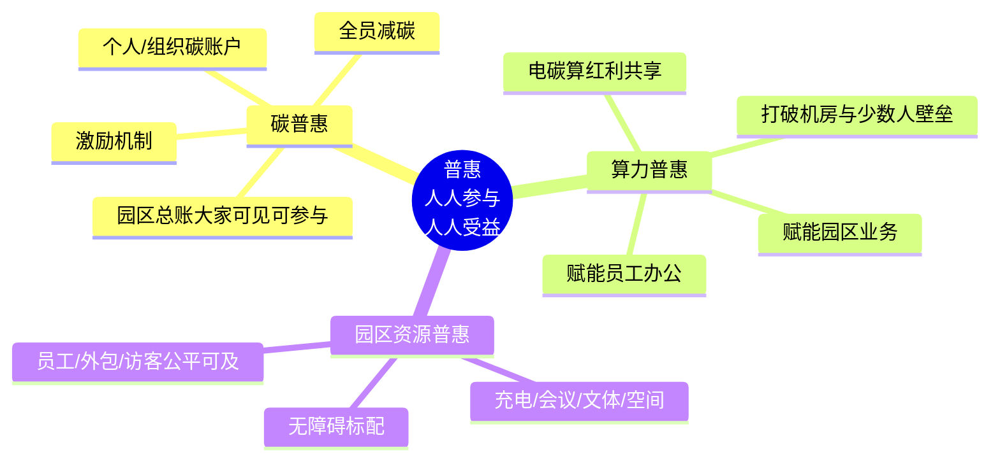

# 南网总部基地框架：“普惠”重写

**短核：** 依托“国家六张网”与“南网六网协同/算电协同”战略，总部基地作为南网名片，将战略资产与第二增长曲线的探索转化为“人人参与、人人受益”的普惠红利，实现碳、算力与园区资源的全面共享。

## 是什么

在南网总部基地的语境下，“普惠”剥离了纯商业维度的投资回报、合同能源管理收费、分档报价或对外售卖产品包的概念，回归其社会价值与人本属性的本质：**人人参与、人人受益**。普惠是基地作为南网名片的温度体现，由三大支柱构成：

1. **碳普惠**：建立覆盖全员的碳减排体系，让低碳行为可计量、可感知、可奖励。园区的碳总账向所有人透明开放，每个人既是减碳的贡献者，也是绿色生态的享有者，真正实现全员减碳。
2. **算力普惠**：将“电、碳、算”协同产生的红利转化为触手可及的生产力工具。算力不再是仅供机房或少数专业人员使用的资源，而是广泛赋能普通员工日常办公与园区各类业务场景的基础设施，让大家都用得上。
3. **园区资源普惠**：打破身份壁垒，确保正式员工、外包人员以及访客在充电、会议、文体活动、空间使用及各类服务上享有公平可及的体验。全场景无障碍设计作为基础标配全面融入，确保所有群体都能无缝融入园区生活。

## 为什么

1. **呼应战略与彰显名片**：普惠是“六网协同”与“算电协同”战略在园区场景下的生动演绎。通过普惠，宏大的战略资产与第二增长曲线转化为员工可感知的日常体验，对外展现南网以人为本、绿色低碳的企业形象，打造一张彰显社会责任的南网名片。
2. **重塑园区连接与认同**：传统的园区管理往往侧重于自上而下的管控与资源的分层分配。普惠理念通过“人人参与、人人受益”，打破了信息与资源的孤岛，激发了全员的主人翁意识，增强了组织凝聚力与文化认同感。
3. **释放数字与绿色红利**：在双碳目标与数字化转型的背景下，只有将碳减排与算力赋能下沉到每一个个体与业务末端，才能最大化释放红利，让绿色与智慧真正惠及园区的每一个角落。

## 怎么做

1. **构建全景式碳普惠体系**：
   - 建立个人与组织双维度的“碳账户”，精准记录绿色出行、无纸化办公、节能用电等减碳行为。
   - 设立丰富的正向激励机制，将碳积分与园区餐饮、文体服务、停车优惠等挂钩。
   - 在园区公共区域通过数据大屏实时展示园区碳总账与减碳排行，让大家都能看见、都能参与，营造全员减碳氛围。

2. **推动算力红利全面下沉**：
   - 依托南网强大的算电协同能力，为员工提供AI办公助手、智能会议纪要等普惠算力工具，提升全员办公效率。
   - 开放园区业务算力接口，支持物业管理、能源调度、安防监控等各业务线按需调用算力资源，实现园区运营的全面智能化。

3. **打造公平可及的资源共享生态**：
   - 统筹规划园区充电桩、会议室、文体中心等公共资源，通过统一的数字化平台实现透明预约与公平分配。
   - 优化服务流程，确保外包团队与访客在权限范围内获得与正式员工同等便利的园区服务体验。
   - 将无障碍理念贯穿于建筑设计、数字终端与服务流程中，确保特殊需求群体在园区内畅行无阻。

## 一揽子

为确保普惠理念的落地，总部基地将引入并整合国内领先的实践经验与厂商能力，形成一揽子解决方案：

- **碳普惠平台实践**：对标国内成熟的城市级或企业级碳普惠平台（如绿普惠、中华环保联合会相关实践），引入具备专业碳核算与账户管理能力的厂商，构建权威、可信的园区碳普惠系统。
- **全员减碳与激励**：借鉴互联网大厂（如腾讯、阿里）的员工低碳行动与公益林模式，联合内部工会与行政部门，设计兼具趣味性与实用性的激励体系。
- **移动员工服务与资源统筹**：对标业界领先的智慧园区移动端应用（如钉钉、飞书的园区解决方案），打造集成充电、会议、餐饮、访客管理于一体的移动员工服务平台，引入具备大型园区综合服务实施经验的厂商（如华为、新华三、腾讯云等候选厂商），确保各项普惠资源一键可达、公平调度。
