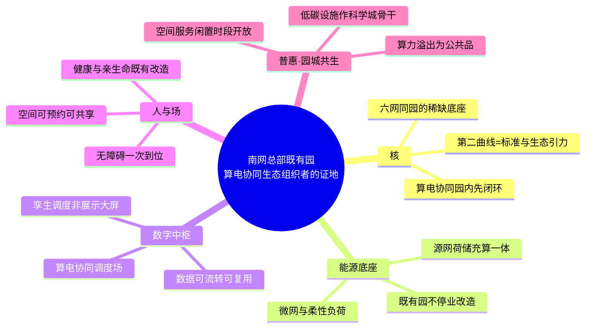

# 广州科学城 · 南网总部/生产科研综合基地既有园升级 · 顶层设计短稿（GLM-5.2 · 独立意见）

## 写在前面

受命做独立顶层设计，非按口径填空。前几轮的"三层核 + 六边形 + 普惠三块"是一套评分招标骨架，正是它催生出领导不认的 V3 建设方案——评分骨架落地即项目清单与 capex，回答不了"这园到底是给谁、为什么必须由南网来建"。本稿换问法：先答"园是做什么的"，再答"怎么改"。可不同意既有切法。

## 核（reframed，三层仍在，但第三层重释）

南网能源公司只起草，园是南网的。本园不是产品展厅，是南网从"电网企业"走向"算电协同生态组织者"的证地与汇聚场。

- **底座**：国家六张网能在一座既有园里同台（电、算、数、热/冷、通……），这种"六网同园"的场地稀缺。
- **协同**：南网六网协同 + 算电协同在园内先闭环——源网荷储充算一体化，先把闭环跑通，再谈外推。
- **价值**：战略资产沉淀 + 第二增长曲线。**但第二曲线不是"卖改造 SKU"**——把总部园做成产品包是品类错位。第二曲线应是"成为算电协同标准与生态的发源地"：园是名片，也是磁体，让标准、人才、厂商在园里长出来。验证再复制属核，不进普惠。

## 脑图

## 边（不取六边，取三"内向角色" + 一"外向普惠"）

六边形是属性评分（零碳/绿色/高效/智慧/人文/普惠），落到既有园就是六张改造清单。本稿按"园在扮演什么角色"切：能源底座、数字中枢、人与场三内向角色，加普惠一外向接口。

### 一、能源底座

**是什么**：园作为源网荷储充算一体化的物理微网，是算电协同的证地。
**为什么**：既有园的真正稀缺不是某栋楼 PUE 多少，而是"一座在用的总部园能把电—冷—算—充调度成一张网"。这是六网协同最小闭环。
**怎么做**：先做全口径碳盘查与分项计量，再以屋顶光伏 + 冰蓄冷 + 柔性负荷 + 充换电补齐，改造不停业、分楼栋滚动；算力负荷纳入调度，让"用算即调电"可见。
**对标**：贵州电力科创园近零碳示范（"八化"，南网自有，复制阻力最小）；佛山周转仓老旧仓库改零碳（既有可改）。
**厂商候选**：南网能源公司（自有，主笔）、安科瑞（能碳平台与计量）、固德威（光储直柔）、协鑫能科（鑫零碳服务）。

### 二、数字中枢

**是什么**：园作为算电协同的调度场与数据底座，不是展示大屏。
**为什么**：北京调研中国移动信息港的关键经验是"预约联动"和"M-PARK 不当大屏"——平台价值在共享调度与可复用数据，不在一块炫技屏。子系统的烟囱和"只看不联"的大屏是同一类病。
**怎么做**：先建园区数字底座做数据融合，再上孪生做能源—环境—安防联动，终端即插即用降集成成本；调度面向多园区统一运营演进。
**对标**：河套深港科创（华为园区 IOC）、临港桃浦（腾讯孪生能源 AI）、两路果园港（华为"2+1+1+5"）。
**厂商候选**：华为（园区数字平台 + F5G-A + 鸿蒙终端）、腾讯云（孪生与能源 AI）、阿里云（园区大脑）、五一视界（既有园 BIM+GIS 孪生）。

### 三、人与场

**是什么**：园作为"人愿意来、留得住"的地方，不是健康/无障碍打分表。
**为什么**：六边里"人文 + 绿色"各占一边，落到既有园常变成景观与认证清单。但总部园对南网的真实作用是吸引研发人才、让外包与访客也愿来。空间体验比认证更根本。
**怎么做**：以 WELL v2 与既有建筑绿色改造为 checklist 分项落地（空气、节律光、静修、健康食堂、EAP）；无障碍按全园标准一次到位，不单点补丁；空间可预约可共享（借信息港预约联动）。
**对标**：上海绿智汇 WELL 金级；竹中工务店既有办公 WELL 改造；建科院既有建筑绿色/健康标准（标准已存在，借用而非另造，且不让评分吞掉策略）。
**厂商候选**：IWBI（WELL 主体）、竹中工务店（既有 WELL 改造）、美的楼宇科技（节律光与个体舒适）、本地 EAP 与无障碍产品商。

## 普惠专节（我的主张：园城共生 / 溢出公共品）

### 中国语境 vs 西方 inclusive

西方 inclusive 根于权利与反歧视——"leave no one out"，焦点是边缘群体（残障、低收入、少数族裔）在既有服务边界内的可及，主要向内。中国"普惠"根于公共品覆盖——普惠金融、普遍服务、普惠算力，框定的是"把一种过剩能力做成公共品，让原本用不上、用不起的更广人群用得上"，常由供给方（国企/银行）承担，主要向外。对总部园，西方问"园内是否对残障访客公平"，中国问"园的低碳/算力/空间过剩，能不能溢出给科学城"。

### 我的主张

**普惠 = 园区把过剩能力做成公共品，溢出到科学城**，三溢出：

- **算力溢出**：园区算力给科学城中小科研与企业按普惠价或免费额度取用——算力像水电，这是"算力普惠"的本义，不是只喂机房与少数团队。
- **低碳溢出**：园区绿电、充换电、碳账能力作为科学城低碳基础设施骨干，周边可接入，让园外主体也能减碳、记账。
- **空间/服务溢出**：文体、会议、托育、无障碍在闲置时段向科学城开放，借信息港"预约联动"做共享调度；无障碍是标配不是普惠的全部。

### 为什么不选另两种

- **不选"人人参与人人受益（内部碳普惠式全员减碳）"**：它把普惠做成员工福利与减碳积分，受益面止于园内，回答不了"园与城的关系"；且与碳普惠政策重叠，非总部园独有，矮化了普惠。
- **不选"投资收益 / EaaS / 卖 SKU"**：它把普惠做成对外卖产品包、按档报价，靠价格排除使用者，方向与普惠相反——普惠按可及性扩大覆盖，不按付费能力分层。它属"核"的第二曲线生意逻辑，不该占用普惠。

### 对标与厂商候选

**对标**：广东碳普惠与北京绿色交易所个人碳账（碳普惠机制）；中国移动信息港预约联动（空间共享调度）；建科院既有园改造公共空间开放标准。
**厂商候选**：南网能源公司（碳账与溢出运营主笔）、华为/阿里云（园区一码通与算力普惠门户）、本地物业与文体运营商（闲置时段开放运营）。

## 收口

本稿不交建设方案。它先定"园是南网身份转换的证地与汇聚场"，再用三内向角色（能源底座/数字中枢/人与场）+ 一外向普惠（园城共生）组织改造。六网同园是底座，算电协同园内先闭环是路径，标准与生态引力是第二曲线。普惠不是福利也不是商品，是园的过剩能力向科学城溢出为公共品。文中厂商与案例均来自公开实践，未签约数据不引、不编。
