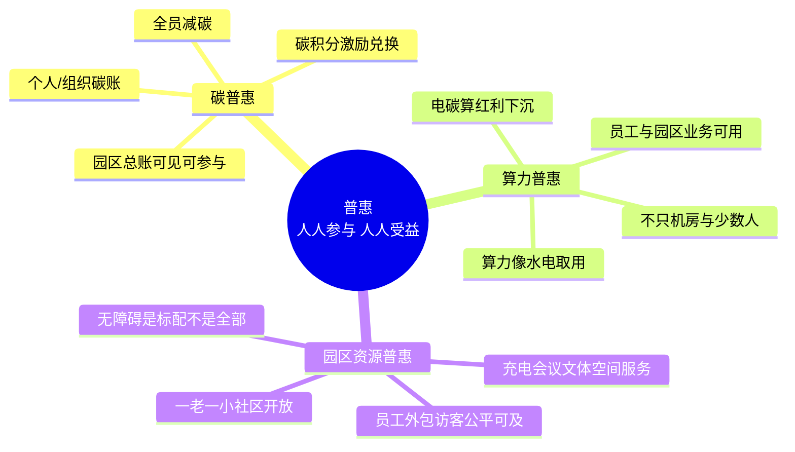

# 南网总部基地既有园 · 普惠一边（GLM-5.2 路 · 第四轮赛马修订）

## 核（一句）

基地是南网名片：以国家六张网为底座，南网六网协同、算电协同，把战略资产沉淀进第二增长曲线；能源公司主笔。普惠这一边只回答一件事——人人参与、人人受益。

## 思维导图

## 是什么

普惠不是产品、不是报价、不是对外卖包，而是基地里每一个人——员工、外包、访客、周边社区——都能参与、都能受益的运行方式。它有三块：

**碳普惠**：全员减碳。给个人和组织建碳账，把步行、公交、光盘、关灯、错峰用电这些日常行为折成碳积分；园区有一本总账，谁减了多少、园区减了多少，大家都看得见、都能参与。激励不靠现金补贴堆出来，靠碳积分兑换停车优惠、食堂加菜、文体优先、公益捐赠。

**算力普惠**：基地的电碳算红利不能只喂给机房和少数科研团队。把园区算力做成像水电一样即取即用的公用设施，让普通员工的报表分析、园区业务的能耗预测、外包团队的仿真测试都能用得上、用得起。反面是"算力孤岛"——贵、专、少人用。

**园区资源普惠**：充电桩、会议室、文体场馆、共享空间、托育医务等服务，对员工、外包、访客公平可及，不因身份设卡。无障碍是标配，不是普惠的全部——无障碍解决"进得来"，普惠还要解决"用得上、用得起、愿意来"。

## 为什么

上一轮把普惠写成了投资收益、分档产品、EaaS、可卖 SKU，那是"核"的生意逻辑，不是普惠。普惠的尺度是参与面和受益面，不是回本周期和毛利率。基地作为南网名片，若只有机房和少数人享受算力、只有正式员工享受资源、只有碳专员看得到碳账，名片就立不住。普惠是把基地的低碳、算力、空间红利，从"少数人专用"变成"人人可及"，让基地既是生产科研基地，也是人人有份的家园。

## 怎么做

**碳普惠**：先建园区碳账平台，把组织碳账与个人碳账并表；再开行为入口（App/小程序/一卡通），让减碳行为可记可证；最后接激励兑换池，与食堂、停车、文体、公益打通。园区总账定期公开，部门之间、楼栋之间可比可赛。

**算力普惠**：把园区算力从"项目级独占"改为"服务级共享"，建园区算力门户，按需申请、按用计费（或免费额度兜底）；面向员工和园区业务开放低门槛算力与模型服务，外包与访客按权限接入。算力调度与电碳调度联动，让"用算即减碳"可见。

**园区资源普惠**：统一一卡通/访客码，把充电、会议、文体、空间、服务按身份分级开放而非一刀切关闭；无障碍按全园标准一次到位，不单点补丁；闲置时段资源向周边社区与一老一小开放，让基地与城市共生。

## 一揽子（可对标国内实践 · 厂商标候选）

- **碳普惠平台**：对标地方碳普惠机制与个人碳账（如广东碳普惠、北京绿色交易所个人碳账）。厂商候选——南网能源公司（自有，碳账与激励运营主体）、腾讯/阿里（碳普惠小程序与碳积分平台）、安科瑞（个人/组织碳账计量）。
- **全员减碳**：对标企业"全员减碳"倡议与员工绿色生活碳账实践。厂商候选——南网能源公司（园区碳账主笔）、本地一卡通与公交运营商（出行减碳数据接入）。
- **移动员工服务**：对标运营商把福利、权益、健康、学习整合一码通的员工服务平台。厂商候选——华为/阿里云（园区一码通与员工服务中台）、本地物业与文体运营商（资源开放运营）。

文中厂商与案例均来自公开实践，未签约数据不引、不编；验证再复制属于"核"，不进普惠这一边。
