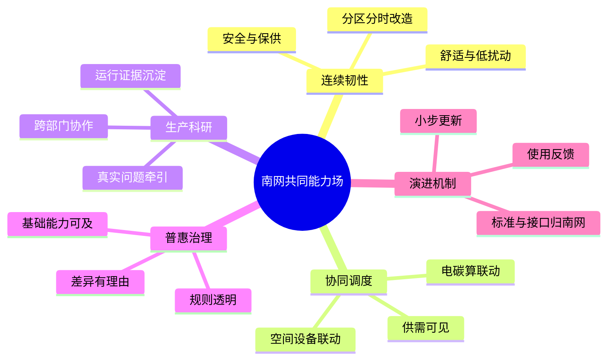

# 从“智慧园区”到南网共同能力场

## 独立判断

这不是一座等待装满新技术的新园，而是一套不能停机、不能割裂业务的既有组织系统。顶层设计的对象因此不应是设备清单或展示平台，而应是**人、空间、能源、算力与组织规则之间的关系**。

**核：在连续办公中，把基地升级为南网可共同使用、可动态调度、可持续演进的能力场。**

国家六张网、南网六网协同与算电协同是方向校准，不必挤进“核”；战略资产和第二增长曲线是运行能力沉淀后的结果，也不宜先写成建设理由。园区属于南网，南网应掌握目标、规则与资产边界；能源公司作为主笔，负责把跨专业问题编成一套可决策、可实施的方案。

## 一核五面

### 连续韧性：先保证“园一直好用”

既有园升级首先是运行工程。以建筑体检和业务影响评估建立底账，把安全、保供、机电健康、热湿环境、无障碍和应急作为共同底盘；按区域、时段和依赖关系安排微更新，任何技术都要回答停工影响、切换路径、故障降级与后续维护。

### 协同调度：从“有系统”转向“会协调”

建立园区资源目录和统一状态语言，让电、碳、算力、会议室、充电、停车、文体空间及设备可查询、可预约、可联动。调度目标不是单项最优，而是在安全、业务优先级、舒适、低碳和公平之间作可解释的平衡。移动信息港调研中的预约联动值得转化为跨系统规则；M-PARK应是服务编排与运营机制，不是另一块大屏。

### 生产科研：把园区变成真实业务接口

以南网真实运行问题组织联合攻关：需求从现场来，方案在现场接受使用反馈，数据、接口、控制策略、运维知识和评价方法归入南网可掌握的资产。这里的“科研”不是另设展项，而是生产、科研、后勤、信息和使用者共同解决问题的工作方式。

### 演进机制：一次建设服从长期运营

平台只做必要的目录、身份、事件和接口能力，避免再造数据孤岛。每项更新都进入“发现问题—协商优先级—小步实施—运行复盘”的循环。清华、移动信息港、建科院等调研对象应分别作为校园长期治理、预约联动、既有建筑性能改造的提问参照，而不是复制对象。

## 普惠专节：我主张“基础能力可及”

中国总部园区的普惠，不只是英文 *inclusive* 的翻译。国外包容性园区常从反歧视、身份差异、无障碍、归属感和合理便利出发，重点是消除特定人群参与工作的障碍；这些原则必须吸收。中国央企总部园还多一层组织治理问题：部门边界、正式与非正式用工、访客与驻场人员、稀缺公共资源和安全权限叠在一起，真正的差距往往不是“有没有设施”，而是**谁知道、谁进得去、谁排得上、遇到问题谁回应**。

因此，本方案把普惠定义为一种园区治理承诺：在必要的安全与业务边界内，每一位合法使用者都能获得与其任务相称的基础能力，并拥有知情、到达、使用、获得协助和反馈复核的清晰路径。它追求的不是结果平均，而是最低保障明确、资源规则透明、差异配置有理由且可复核。无障碍是这套承诺的底线之一，碳账户、算力服务、充电和空间预约则是它可能覆盖的对象。

另两种定义各有价值，但不适合作为总纲。“福利均分”直观，却会把不同任务、时段和安全责任压成相同份额，既不等于公平，也容易造成闲置；它可用于确定基本保障，不能指导全部资源配置。“参与激励”能推动低碳行为和共创，却容易只奖励可计量、善表达的人，并把系统应承担的责任转给个人；它适合作为碳普惠等专项工具，不能代替基础可及。

这一定义落到五件事：形成所有公共能力的服务目录；以身份和任务而非部门关系配置权限；用统一移动入口呈现余量、规则、候补和无障碍信息；公开资源冲突的排序原则；持续审视不同群体在等待、失败、绕行和反馈闭环上的差距。普惠由此不是一条“福利边”，而是检验其余四面是否真正成为共同能力的标尺。

## 首轮方案包

- **一本运行底账：**建筑、机电、能碳、算力、空间、服务与用户障碍放在同一问题地图上。
- **一张共同资源图：**先统一目录、状态、责任人与接口，再决定哪些系统联动。
- **一个移动服务入口：**查询、预约、通行、报障、候补和反馈贯通，入口统一但后台可分步改造。
- **一套资源章程：**写清基础保障、业务优先、冲突排序、安全例外、隐私边界和复核责任。
- **一批微更新场景：**选择跨部门高频痛点，以不中断办公的方式验证调度规则和服务闭环。
- **一个南网资产包：**沉淀标准、接口、数据字典、控制策略、运维手册与决策记录；厂商交付服从这些边界。
