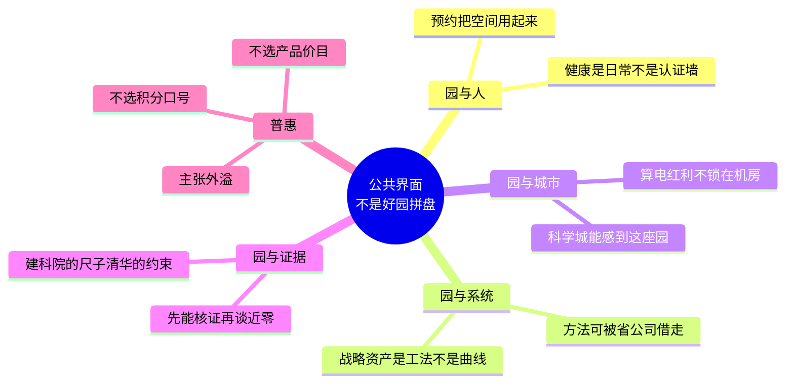

# 科学城既有园：从好园改成南网的公共界面

核一句：园已经建成、人已经在里面办公；升级要改的不是设备清单，而是它和驻园的人、和南网系统、和科学城之间的关系——把围墙里的好园，写成南网能被看见、方法能被借走的公共界面。

我们不把「国家六张网 / 南网六网协同与算电协同 / 战略资产与第二增长曲线」叠成三层核。那是电网经营话语和一份课题的标题，解释不了领导为什么不认建设方案 V3。V3 败在把连续办公的既有园当成新建工程来写。能源公司只主笔、园是南网的：主笔权一旦写成经营权，稿就会偏。六张网、六网协同在园里只体现为电、冷、碳、算、人在同一座园里被一起调度，不必重抄纲领。

也不用零碳—绿色—高效—智慧—人文—普惠六边切片。前三边抢同一块电、同一本账；智慧和人文是手段与感受。属性形容词适合开会，不适合当战略。我们按关系切四边。

## 四边

**园与人。** 北京信息港有用的不是大屏，是会议预约带动照明和末端，M-PARK 把餐厅、场馆、洗车收成可预约的员工服务。本园外立面不能大改、屋顶光伏有限、设备未到报废、停不了园：改得动的是回路和规则。健康、光声、无障碍走这边——把人当使用者，不是当参观对象。

**园与系统。** 钱朝阳课题里能站住的是「战略资产」：核算边界、冷站在实时电价下怎么调、机房余热怎么给办公，写成别的连续办公园能借的工法。第二增长曲线如果出现，是工法被系统借走之后的事，不宜当本园标题。验证再复制属于这边。

**园与城市。** 科学城要能感到南网总部在：绿电怎么用、负荷怎么让、参观动线怎么走。算电协同的意义不是机房更亮，而是余热、柔性、算力额度回到园区业务和培训。总部若只对内发光，对城市就是一座漂亮的飞地。

**园与证据。** 清华会中主张按碳中和定位、不机械套零碳；建科院给出住建部台阶这把尺子。供冷是广州的大头，冰蓄冷旧逻辑随电价机制在失效。先钉边界和可核证路径，再谈近零。认证是尺子，不是名片。

## 普惠：外溢，不是门口，也不是价目

国外 inclusive 问门口：谁被台阶、身份、语言挡在外面。无障碍、通用设计、社区开放日，管的是进入权。中国语境里，总部园的「普惠」问的是围墙落差。绿电、算力、好空间、可信的方法，是只供驻园的人享用，还是设计成能外溢到系统和城市。普惠金融降低的是获得一种能力的门槛；碳普惠让小事进入公共账本。二者都不是给总部发福利，也不是把园打包出售。共同富裕落到一座央企园，就是总部不能把自己做成能源贵族区。

我们主张**外溢型普惠**：总部的好东西按「可被借、可被感、可被学会」来设计。碳账是系统能对照的示范账——个人与组织可以记账，账的第一读者是南网其他园，积分是附带，不是目的。算力跟电走：额度给园区业务，余热给办公区，对标信息港把数据中心热送给办公，而不是把算电红利锁给机房班组。充电、会议、文体、空间对员工、外包、访客按身份公平可及，这是园与人的开口；对科学城保持可感知的界面，这是园与城市的开口。信息港式预约共享可以留，作为用法，不作为对外产品包。无障碍是开口的标配，不是普惠的全部。

另外两种我们看过，不取。

「人人参与、人人受益」这路话不错，粒度是工会和后勤。它会收成碳积分和员工 App，回答不了这座园对省公司和科学城意味着什么，也撑不起 V3 被否之后还要再写的那一版顶层。

投资回报、合同能源收费、EaaS、分档 SKU 这路，是把主笔单位写成园主。普惠在汉语政策里从来不是价目表的同义词。可卖如果发生，是外溢成功以后的管理结果，不能反客为主来定义普惠。

一揽子只做三件：一本对系统公开的能碳总账（建科院的尺子、清华的约束）；一套预约驱动的用园规则（信息港逻辑，M-PARK 当服务）；一条可被其他园借走的工法（冷站与交易、余热、行为联动）。厂商是候选，不是已在场的甲方。
