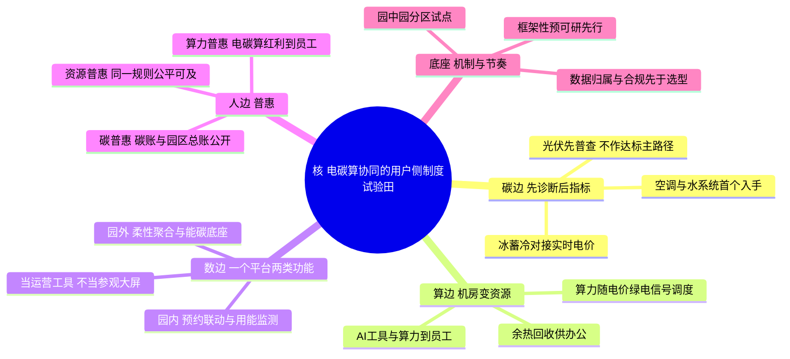

# 既有园区升级顶层设计短稿：从用能大户到制度试验田

**对象**：南网总部/生产科研综合基地（广州科学城）既有园区升级
**立场**：独立机构视角稿。不沿用既有三层核与六边切法，普惠一节也不采用"人人参与、人人受益"的复述式定义；不同之处随文说明理由。
**时间**：2026年8月

## 一、核

一句话：把总部基地从"被改造的用能大户"，改写为南网电碳算协同在用户侧的第一块制度试验田——在数千人连续办公的真实园区里，把电网侧的电碳算能力翻译成人人可用、人人可参与的日常机制，为国家六张网协同提供一个可参观、可核证的央企总部样本。

三个支撑：

1. **国家要样本**。水网、新型电网、算力网等六张网正从各自建设走向协同，缺的恰是用户侧、园区级的落地形态。央企总部做碳中和与算电协同的实证，正逢政策窗口。
2. **南网要翻译**。电碳算协同已建成行业级系统，但目前停在调度与机房尺度。它要成为第二增长曲线，必须先被翻译成用户侧的制度与体验；自家园区是成本最低、可信度最高的翻译场，也是"战略资产"课题可建设的具体形态。
3. **基地要理由**。既有园、连续办公、设备中年、立面受限，单项技术账算不出立项理由，只有挂到集团战略上，升级才成立。能源公司主笔的正确姿势是替集团写战略，不是向集团卖工程——V3 建设方案不被认可，症结正在于此。

与既有三层核（国家六张网—南网六网协同—战略资产与第二增长曲线）的关系：三层核是讲给决策层的合法性链条，回答"为什么轮到我们做"；本稿的核是指导方案的设计逻辑，回答"做成什么样"。二者不冲突，本稿把"战略资产"落到"制度试验田"这一可建设、可考核的形态上。

## 二、脑图

## 三、边：四边一底，不设六边

既有六边切法按主题分块，容易写成六份产品简介且彼此重叠。本稿按机制分边：碳、算、数、人四边共用一套电碳算底座，边上每件事都要能回答"它怎样把负荷变成资源"。

- **碳边：先诊断，后指标**。空调与水系统是首个入手点（既有调研中两方独立给出的节能区间量级接近）；光伏先做屋顶与立面资源普查，不作达标主路径；固定低谷时段取消后，冰蓄冷的控制策略须与实时电价和交易系统对接。目标层级（低碳、近零碳、碳中和）并列呈现达成条件与代价，交由决策，不预设。
- **算边：机房从纯负荷变资源**。余热回收供办公区（北京调研已有对位样本）；算力任务随电价与绿电信号调度，让数据中心从刚性负荷变成柔性资源；员工侧的算力与 AI 工具接入普惠通道。
- **数边：一个平台、两类功能**。园内一侧做办公行为与用能设备的联动（会议预约驱动照明空调，北京调研已见成熟做法），园外一侧做负荷柔性聚合与能碳底座；两侧统一规划，避免二次集成。平台是运营工具，不是参观大屏；数据归属与合规要求先于厂商选型。
- **人边：普惠**。见专节。
- **底座：机制与节奏**。园中园分区试点，按可停机窗口、用能可计量、措施可复制、成效可验证四项标准比选；框架性预可研先行，缺数据处显性留白，不以估算值替代。

## 四、普惠专节

### 4.1 三种候选定义

- **甲·福利普惠**：普惠即园区公共服务的公平可及——充电、会议、文体、空间对员工、外包、访客同一规则开放，无障碍作标配。这是"人人受益"的直白读法，对标互联网大厂的员工服务体系。
- **乙·产品普惠**：普惠即把园区能力做成可负担的标准化产品对外输出——能源托管、分档方案、按效果付费，让外部中小企业"用得起"。这是普惠金融"可得性"逻辑的直译。
- **丙·机制普惠（本稿主张）**：普惠是一套双向机制。向下，把电、碳、算的系统红利制度性地送到每个人和每个业务单元手上；向上，把每个人的微小减碳行为制度性地计量、赋值、汇聚成园区资产。对标广东碳普惠制、深圳"低碳星球"、成都"碳惠天府"的"量化—赋值—激励"机制（平台与厂商均为候选，不涉及选型）。

### 4.2 为什么选丙，不选甲、乙

不选甲：福利普惠是物业运营的及格线，不是战略。它回答"园区对谁好"，回答不了"南网为什么要做"；全是投入、没有机制，决策层看到的只是一张成本清单。它应当作为丙的一条通道存在，而不是普惠的定义。

不选乙：对象错位。总部园的第一服务对象是集团战略与园内的人，不是外部客户；主笔的能源公司恰是潜在卖方，这样写等于向母公司推销，V3 的教训正在于此。且"验证再复制"若要发生，是核层面的结果，不能预写进普惠当定义。

选丙：它是唯一同时答上三问的选项——南网为什么做（电碳算协同的用户侧制度实证，只有电网企业有条件做）；园区凭什么立项（把数千人从负荷变成柔性资源和减碳主体，是近零碳目标最便宜的一段路径）；普惠为什么不偏题（不是投资收益，也不是福利清单，而是机制安排）。上一轮把碳、算力、资源写成并列三块，内容不错、位置错了：它们不是普惠的定义，而是丙这套机制的三条通道。

### 4.3 中国语境与国外 inclusive 之别

国外 inclusive（inclusive design、DEI）是权利话语：问"谁被挡在门外"，为少数与弱者移除障碍，目标是"不被落下"，静态、合规导向。中国的普惠是发展话语，从普惠金融到共同富裕：问"系统的能力怎样让大多数人用得上、每个人的小贡献怎样积少成多"，目标是"人人能进场、人人有账户"，动态、机制导向。普惠金融的经验是：发补贴不可持续，建机制才可持续——给无征信者建信用档案，而不是给他们免单。园区同理：普惠不是多建一批设施，而是建碳账、算力券、资源预约三套机制。无障碍在 inclusive 里是内涵，在普惠里只是标配底线。

### 4.4 丙的三条通道

- **碳普惠**：个人与组织碳账，行为可量化、积分可激励；园区碳总账全员可见、人人可参与，不是管理层专报。对标广东碳普惠制、深圳"低碳星球"、成都"碳惠天府"（平台厂商候选）。
- **算力普惠**：电碳算协同的红利——绿电窗口、弹性算力、AI 工具——做成员工与园区业务日常可用的服务，不只供机房与少数部门；让算电协同在人的尺度被感知。这是电网企业总部园独有的一格，也是第二增长曲线在园内的预演。
- **资源普惠**：充电、会议、文体、空间、服务对员工、外包、访客同一规则可及，预约规则与使用数据公开；无障碍为标配。它是底线通道，按机制讲（规则公开、数据公开），不按福利讲（投放多少设施）。

## 五、落地节奏（简）

园中园分区试点先行，取得本园实测数据以替换口述大数；平台按一个平台、两类功能统一规划；碳账、算力、资源三套机制随试点同步上线、逐区推广；框架性预可研按结果导向编制，目标层级并列供决策，缺数据处留白。
