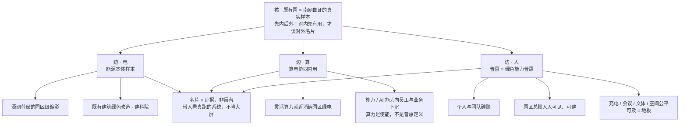

# 广州科学城 · 南网总部 / 生产科研综合基地既有园升级 —— 独立顶层设计（短稿）

> 立场：本稿以独立机构口径写，不预设既有的"三层核 / 六边切法 / 普惠定义"。已知事实只当输入，不当骨架：既有连续办公园（非新建）、能源公司只起草、园归南网、国家六张网与南网的六网协同 / 算电协同、钱朝阳课题的战略资产与第二增长曲线、北京调研（清华、移动信息港"预约联动 / M-PARK 不当大屏"、建科院）、V3 建设方案未获认可。不编数字、不写已签约。

## 一、核（一句）

**这座既有园不是南网的展台，而是南网把"六网协同、算电协同、第二增长曲线"先在自己身上跑通的一块真实负荷与真实样本；它得先对园里每个人有用，才配当对外的名片。**

三层意思：

- **既有、连续、在办公**——升级对象是"正在运行的活系统"，不能套新建园的展示逻辑；先测、后改、用运行数据说话（建科院式既有建筑绿色改造是这一路）。
- **园归南网、能源公司只起草**——方案的第一读者是南网自己的人，不是外部客户。先内后外：对内先有用，对外才有说服力。
- **名片靠证据、不靠大屏**——移动信息港 M-PARK"不当大屏"的教训在此：名片是"带人来看真在跑的系统"，不是可视化秀。V3 被否，多半也否在展台化 / 产品化，而非否在本业。

## 二、边（三条，不必六）

**边 · 电｜能源本体样本。** 把既有园做成"源网荷储"的园区级缩影：柔性负荷可观测、可调节，既有建筑绿色改造先行。是什么——电网公司在自己楼里跑通本业的最小样本；为什么——本业可信度 > 概念新鲜度；怎么做——先建可核验的运行底座，再谈对外。

**边 · 算｜算电协同内用。** 让灵活算力就近消纳园区绿电，并把算力 / AI 能力向员工与业务下沉。关键定性：算力是**使能**，不是普惠的定义（见第三节），更不做"对外卖算力"的产品化。

**边 · 人｜普惠。** 见专节。服务的公平可及是地板；"绿色能力人人可建、人人可见"才是这条边的主张。

三条边共同指向同一个出口——**名片 = 证据**：来访者看到的永远是真在运行、可核验的系统，而不是展示厅。

## 三、普惠专节：中国语境的"普惠"该怎么读

### 3.1 中式"普惠"≠ 西式 inclusive

西式 inclusive 的重心是"不排斥"：拆障碍、护个体与少数、无障碍设计，衡量"有没有人被落下"，本质是**单向的可及性伦理**。中式"普惠"（普惠金融、碳普惠）多一层——**"普"是覆盖面，"惠"是主动让利**：由一个机构把好处以低门槛铺给所有人，尤其铺给平时被忽略的普通人；而且它常是**双向**的——个人的微小参与被聚合，反过来成为可计量、可增值的公共资产。所以"无障碍"在中式普惠里只是地板，不是全部。

### 3.2 三种可能的读法

- **A · 服务普惠**：充电、会议、文体、空间、服务，对员工 / 外包 / 访客公平可及。
- **B · 算力普惠**：绿色算力与 AI 工具人人能用，不独归机房与少数团队。
- **C · 绿色能力普惠（以碳普惠为锚）**：把每个人的日常工作与行为，变成可见、可聚合的低碳能力——个人与团队碳账、园区总账人人可见、人人可建。

### 3.3 我主张 C，并说明为什么不选 A、B

我选 **C · 绿色能力普惠**。

- 只有 C 是**双向**的、也是真正中式的"普惠"：人既受惠，其参与又聚合成园区的绿色资产，直接喂给"真实样本"这个核，也才接得住"战略资产 / 第二增长曲线"。
- 广东本就是碳普惠的先行地（广州 / 广东碳普惠平台，全民层面可参照蚂蚁森林式的绿色行为聚合），对一家电网公司天然对味——这是国外 inclusive 里没有的路径。

**不选 A**：服务公平是必需，但它是单向消费，是任何像样园区都该有的卫生条件，撑不起顶层设计。把普惠等同于 A，就退回西式 inclusive 的可及性基线。故 A 只当地板，不当主张。

**不选 B**：算力普惠听着贴"算电协同"，却把"手段"当成了"目的"。多数人感知不到算力，普惠若以此定义，就丢了"人人可感、人人可参与"；且极易滑向对外卖算力 / EaaS 的产品化——正是被否的老路。算力应留在"算"这条边当使能，不当普惠的定义。

### 3.4 怎么做（不编数字）

个人 / 团队碳账随日常办公自动记账；园区总账在克制、真实的界面上人人可见、可参与（学移动信息港的"预约联动"式轻交互，避开大屏秀）；服务公平可及作为地板同步补齐。所有口径**先可核验、再对外展示**。

## 四、脑图

## 五、一句收束

把既有园做成"南网先对自己人有用、再让外人来核验"的真实样本；普惠不是让利卖点，而是让园里每个人的绿色参与被看见、被聚合成南网的资产——这才是这张名片值钱的地方。
